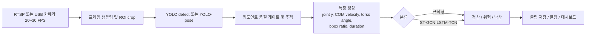
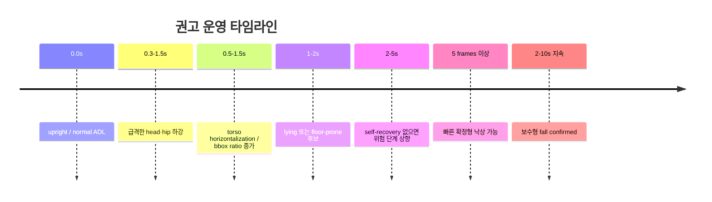

# 카메라 기반 YOLO 낙상·행동인식 프로젝트 심층조사

## 요약

이번 조사에서 확인된 공개 프로젝트들은 크게 두 갈래로 나뉘었습니다. 첫째는 **YOLO 또는 YOLO-Pose 단독으로 낙상 여부를 직접 분류하는 구조**이고, 둘째는 **YOLO-Pose로 skeleton을 뽑은 뒤 ST-GCN·LSTM 같은 시간축 분류기로 일상행동과 낙상을 함께 분류하는 구조**입니다. 후자가 독거노인 케어 서비스에 훨씬 적합했습니다. 그 이유는 낙상만 잡는 것이 아니라 walking, sitting, standing, lying, sitting down, standing up 같은 **일상행동과 전이 행동**까지 분류해야 위험도를 안정적으로 나눌 수 있기 때문입니다. 실제로 elderly 일상행동을 7개 클래스로 분류한 YOLOv7-Pose + ST-GCN 시스템은 30프레임 시퀀스를 써서 90% 정확도를 보고했고, 프라이버시 보존형 elderly 모니터링 시스템도 sitting·standing·walking·lying·fall과 전이행동을 함께 다뤘습니다. citeturn18view0turn19view2turn40view0turn41view3

반대로 논문들 상당수는 **정확한 벡터 임계값**을 공개하지 않았고, “pose-based post-processing”, “multi-tiered confidence”, “motion sequence analysis”처럼 원리만 적는 경우가 많았습니다. 실제로 수치가 공개된 것은 오히려 공개 구현 저장소 쪽이 많았고, 그 안에서 반복적으로 등장한 값은 대체로 **pose confidence 0.60~0.65**, **keypoint confidence 0.20~0.35**, **visible keypoints 6~8개 이상**, **bbox aspect ratio 1.4 이상**, **y-spread ratio 0.45 이하**, **연속 5프레임 이상**, 또는 **낙상 후 2~10초 이상 lying/no-move 지속** 같은 형태였습니다. 또 다른 공개 구현은 **center-of-mass velocity 60 px/s**, **vertical drop 20 px**, **aspect-ratio delta 0.35**를 기본값으로 사용했습니다. citeturn16view0turn13view0turn36view0turn36view1

실서비스 관점에서는 **RTSP 20~30 FPS 입력 자체는 충분**합니다. 실제 surveyed 프로젝트들도 30 FPS 카메라를 가장 많이 썼고, 시퀀스 길이도 대개 **30프레임 ≈ 1초**였습니다. 다만 입력 FPS와 별개로 **실제 YOLO 추론 FPS가 5 FPS 수준이면 near-fall, 비틀거림, 급격한 자세전환 같은 위험도 분류 품질은 떨어질 가능성이 큽니다**. 낙상 “확정”만 보면 5~8 FPS도 동작할 수 있지만, 정상행동·위험행동·낙상을 함께 분리하려면 **최소 8~12 FPS, 가능하면 15 FPS 안팎**이 현실적인 목표입니다. 이 판단은 30 FPS 카메라, 30프레임 윈도우, 1.5초 fall window, 5-frame confirm 규칙을 쓴 프로젝트들을 종합한 서비스 설계 추정입니다. citeturn19view0turn14view0turn30view0turn48view0turn50view0

## 조사 범위와 파이프라인

이번 정리는 **카메라 기반**, **YOLO 또는 YOLO-Pose 사용**, **독거노인·elderly 모니터링 또는 fall detection에 직접 연결되는 프로젝트**만 우선 포함했습니다. 한국 공개사례는 상대적으로 **구현 저장소/합성데이터 중심**이었고, 해외는 **논문+코드+정량평가**가 더 풍부했습니다. 표에서 세부 항목이 공개되지 않은 경우는 모두 **“미상”**으로 표기했습니다. citeturn37view0turn18view0turn39view0turn50view0turn48view0

다음 흐름은 조사된 프로젝트들에서 가장 공통적으로 반복된 파이프라인입니다. YOLO detection만 쓰는 경우도 있었지만, **독거노인 케어서비스**처럼 정상행동·위험도·낙상을 같이 보려면 **pose + tracking + temporal classifier**가 사실상 표준형에 가깝습니다. citeturn18view0turn39view0turn14view0turn22view0

프로젝트들이 실제로 쓰는 시간축 로직도 거의 유사했습니다. **fall은 1초 안팎의 빠른 하강 + 이후 horizontal/lying/no-move**로 잡는 경우가 많았고, ADL 분류는 **30프레임 윈도우**가 가장 흔했습니다. 아래 타임라인은 조사 내용을 바탕으로 재구성한 **권고 운영 타임라인**입니다. Falls typically occur within about 1.5 seconds라는 설명도 한 최근 논문에서 그대로 반복됩니다. citeturn30view0turn19view0turn16view0turn13view0

## 프로젝트 비교표

아래 표는 older-adult/elderly 모니터링과 직접 연결되는 공개 프로젝트들을 우선 정리한 것입니다. “링크” 칸의 인용은 공식 논문 또는 공식 저장소를 가리킵니다.

| 프로젝트 | 국가 / 연도 | 링크 | 하드웨어 / 카메라 | 모델 / 배포형식 | 파이프라인 | 행동 라벨 | 기준·특징·수치 | 시계열 / 분류기 / 성능 |
|---|---|---|---|---|---|---|---|---|
| **관심법 지능형 CCTV 기반 응급·비상 상황 감지 시스템** | 한국 / 2025 | 저장소 citeturn37view0 | 관리 PC + AI 서버, UDP 송수신, 카메라 해상도·FPS 미상 | YOLO Pose + Face ID, 배포형식 미상 | 관리 PC 캡처 → UDP → AI 서버 YOLO 추론 → 이벤트 전송 → 15초 클립 저장 | laying 예시, face ID | laying 라벨 감지 시 이벤트 생성, 미등록 인물 로그는 2초 이상 지속 시 기록, 이벤트 클립 15초. 정확한 pose threshold는 미공개. | 실제 서비스형 통합 예제. 합성 Simuletic 데이터 사용. 정량평가 미공개. citeturn37view0 |
| **The Combination of Face Identification and Action Recognition for Fall Detection** | 베트남 / 2022 | 논문·저장소 citeturn18view0turn17view0 | AMD Ryzen 7 4800H, 16GB RAM, GTX1650; KBVISION Kbone KN-H41P 2K 4MP IP Wi-Fi camera, 30 FPS | YOLOv7-Pose + ST-GCN 또는 LSTM; 얼굴은 YOLO5Face + ResNet18 | IP 카메라 30 FPS → YOLOv7-Pose skeleton → 30프레임 volume → ST-GCN/LSTM → 행동 | standing, standing up, sitting, sitting down, walking, lying, falling | pose stream은 `(x,y,s)`, motion stream은 연속 프레임 간 `(Δx,Δy)`; 전이 구간 30프레임 volume 제거 후 학습 | two-stream ST-GCN 9 layers, BCE, lr 0.0001; ST-GCN 정확도 0.90, mean F1 0.90; 시스템 평균 15–20 FPS. citeturn19view2turn19view1 |
| **Privacy-Preserving Elderly Activity Monitoring Using Pose Estimation** | 카타르 / 2025 | 논문 citeturn39view0 | Jetson Xavier, RTX A5000, AMD Ryzen 4700U; RGB camera, 원본 비영상 저장 지향 | YOLO person detector + AlphaPose + ST-GCN | RGB camera → YOLO person detect → AlphaPose 17 keypoints → ST-GCN → anomaly layer → caregiver dashboard | sitting, standing, walking, lying down, falling + transitional activities | 256×192 입력 전처리, 17 keypoints; anomaly는 sudden Z-drop, prolonged inactivity, excessive torso bending; inactivity 예시는 10시간 | ST-GCN, Adam lr 0.001, batchnorm+dropout; Jetson 30 FPS target, CPU 15–20 FPS; class F1 walking 0.94, sitting 0.94, fall 0.88. citeturn42view3turn42view1turn41view0turn40view0 |
| **Elderly Fall Detection using YOLOv8 and MediaPipe** | 미상 / 2024 | 저장소 citeturn22view0 | 미상 | YOLOv8 detect + MediaPipe pose | video clips → YOLOv8 human detect → MediaPipe pose → shoulder/hip angle → posture label → alert | standing, falling, lying down | shoulders·hips 각도로 posture 분류; alert time threshold 존재하나 수치는 미공개 | 교육 프로젝트지만 posture-angle 방식이 명확. 해상도·FPS·정량평가·threshold 값은 미공개. citeturn22view0 |
| **Elderly Guardian — Edge Fall Detection** | 미상 / 2025 | 저장소 citeturn14view0turn16view0 | RK3588 SBC + Metis M.2 accelerator; Logitech C920, 권장 1280×720@30 FPS | YOLOv8l-pose, Axelera Voyager SDK | USB camera → 640×640 letterbox → YOLOv8 Pose → quality filters → heuristic fall analysis → Kasa alert | normal activity, sitting, actual fall, recovery | bbox area 60,000–300,000 px² 기본값, 예시 실행 90,000–220,000; pose conf ≥0.60 기본 / 0.65 예시; kp conf ≥0.35; visible kp ≥6 기본 / 8 예시; fall if `aspect>1.4` and `yspread_ratio<0.45`; `fall_frames=5`; cooldown 30s | 규칙형. 근접 오탐엔 proximity guard, 멀어짐엔 retreat guard, slow fall은 floor-prone detection으로 보완. citeturn14view0turn16view0 |
| **Efficient Vision Based Fall Detection for Elderly Surveillance Using YOLOv11** | 미상 / 2025 | 논문·저장소 citeturn20view0 | 카메라 종류 미상 | YOLOv11 nano fine-tuned; webcam/video; repo는 PyTorch 기반 | camera/video → preprocessing → YOLOv11 detection → transient filtering + confidence scoring → alert/logging | fall vs non-fall/transient | inference 예시 `conf=0.4`; transient non-fall(rapid sitting, bending) 제거 후 false positive 감소 | LE2I subset 기준 95% accuracy, 25 FPS; epochs 50, batch-size 16. Skeleton 기반이 아니라 detect-only라 ADL 확장성은 낮음. citeturn20view0 |
| **Real-Time Fall Detection for the Elderly in Home Settings Using a Vision-Based YOLOv8-Pose Model** | 이라크 / 2025 | 논문 citeturn50view0turn51view3 | smartphone camera, 1080p, 30 FPS; home-like environment | YOLOv8-Pose; 결론부는 YOLOv8m-based model 지칭 | smartphone capture → COCO annotation → transfer learning → YOLOv8-Pose → pose-based postprocess → Telegram alert | falls, bending, normal/natural motions | 186 high-resolution videos; multi-tiered confidence rating system; enhanced thresholding/post-processing로 sitting/bending과 fall 구분. 정확한 threshold 값은 미공개 | Precision 97.8%, Recall 97.50%, F1 97.66%, mAP@50 99%; young participants 21–29세만 사용했다는 한계가 명시됨. citeturn51view2 |
| **Fall Detection in Elderly People at Home Using the YOLOv11-Pose Model** | 이라크 / 2025 | 논문 citeturn48view0turn49view0 | phone camera, high-resolution; 입력 640×640 | YOLOv11n/s/m-pose 비교; standardized training | phone capture → labeling/optimization → multiple YOLOv11-pose trains → compare → smart alert concept | falls + daily activities | lr 0.001, batch 8, epochs 100, imgsz 640, momentum 0.937, weight decay 0.0005; exact heuristic threshold는 미공개 | smaller models around 95 FPS, YOLOv11m mAP@50 99.43%, mAP@50-95 92.78%. 향후 more activities 확장 필요. citeturn49view2turn49view0 |
| **Elderly Fall Detection Based on YOLO and Pose Estimation** | 중국 / 2024 | 논문 citeturn30view0 | test video 기반; 실제 배포 HW 미상 | YOLOv8n chosen + YOLOv8-Pose (`yolov8x-pose-p6.pt`) | Kaggle/UR Fall 기반 데이터 → YOLO version 비교 → YOLOv8-Pose로 motion speed + torso angle 확인 | fall, lying-related distinction | fall은 대개 1.5초 안에 발생한다고 보고; hip/shoulder speed threshold, torso angle threshold, fall duration check를 사용했으나 수치는 미공개 | final realtime fall-detection accuracy 92%; train 374 images, val 111 images로 데이터 규모가 작음. citeturn30view0 |

## 프로젝트별 핵심 분석

가장 실무적으로 중요한 건, **논문이 아니라 공개 구현에 exact thresholds가 더 많이 남아 있다**는 점입니다. 따라서 “어떤 벡터값을 기준으로 위험·낙상을 판별했는가”를 따지면, elderly 전용 논문만 보는 것보다 **elderly 서비스에 그대로 가져다 쓸 수 있는 공개 규칙형 구현**을 함께 봐야 합니다. 아래 표는 그 중에서 threshold가 명시적으로 드러난 사례만 따로 추렸습니다. 다만 `Y-B-Class`는 고령자 전용 논문은 아니므로 **설계 참고용 공개 구현**으로 보시는 것이 맞습니다. citeturn16view0turn13view0turn36view1

| 출처 | 추출 특징 | 공개된 정확한 규칙 / 수치 | 해석 |
|---|---|---|---|
| **Elderly Guardian** | bbox area, pose conf, kp conf, visible kp 수, bbox aspect, keypoint y spread | bbox area 60,000–300,000 px² 기본값; pose conf ≥0.60; kp conf ≥0.35; visible kp ≥6; `fallen = (aspect > 1.4) and (yspread_ratio < 0.45)`; 연속 `fall_frames=5` 필요 | **가장 실전적인 품질게이트 + horizontalization 규칙**. 특히 `aspect > 1.4`와 `yspread_ratio < 0.45`는 쓰기 쉽습니다. citeturn16view0turn14view0 |
| **16dina/fall-detection** | keypoint y-values, 초기 자세 spread, 1번·6번 점의 frame 간 y 차이, duration | `falling_threshold = ((maxY-minY)*2/3)+20`; `first_point_threshold = initial diff +15`; `second_point_threshold = initial diff +15`; keypoints 6개 이상 필요; fallen/laying/no-human 상태가 `10초` 이상 지속되면 alert | 카메라 설치마다 absolute px가 달라지는 문제를 **초기 자세 기반 동적 threshold**로 푼 예입니다. citeturn13view0 |
| **Y-B-Class Human-Fall-Detection** | center-of-mass velocity, vertical displacement dy, aspect-ratio delta, visible joints | default `FPS=30`, `WINDOW_SIZE=30`, `V_THRESH=60`, `DY_THRESH=20`, `ASPECT_RATIO_THRESH=0.35`; `v>60 && dy>20 && ar_end>0.1` 또는 `dy>20 && ar_delta>0.35`; visible joints ≥10, required joint conf >0.2 | **속도·낙하량·자세평탄화**를 함께 보려면 가장 참고하기 좋은 공개 숫자 셋입니다. citeturn36view0turn36view1turn35view1 |
| **Privacy-Preserving Elderly Monitoring** | Z-coordinate drop, inactivity duration, torso bending | sudden unexplained Z-drop, inactivity threshold example `10시간`, excessive torso bending. 정확한 angle threshold는 미공개 | **낙상뿐 아니라 prolonged inactivity와 posture anomaly를 같이 보자**는 철학이 명확합니다. citeturn42view3 |

행동 라벨 관점에서 가장 참고할 가치가 큰 프로젝트는 **DuyNguDao의 YOLOv7-Pose + ST-GCN**입니다. 이 시스템은 단순히 falling/not-falling이 아니라 **standing, standing up, sitting, sitting down, walking, lying, falling**의 7개 행동을 썼고, 입력도 단순 좌표가 아니라 **pose stream `(x,y,s)` + motion stream `(Δx,Δy)`**를 함께 먹였습니다. 즉, “한 프레임 자세”보다 “짧은 시간 동안의 자세 변화”가 더 중요하다는 것을 잘 보여줍니다. 독거노인 서비스가 낙상만이 아니라 일상행동과 위험도 분류를 하려면 이 방식이 가장 가깝습니다. citeturn19view2turn19view1

반대로 **YOLOv8/YOLOv11 recent pose papers**는 최신 성능 지표는 좋지만, exact threshold 공개는 부족했습니다. 이라크의 YOLOv8-Pose 논문은 186개 1080p/30 FPS 스마트폰 비디오로 학습하고, bending·normal motion과 fall을 구분하는 multi-tiered confidence system과 thresholding을 언급하면서도 숫자는 공개하지 않았습니다. YOLOv11-Pose 논문도 학습 hyperparameter와 mAP/FPS는 자세히 제시했지만, 실제 operational fall rule은 end-to-end model 성능 중심으로 서술했습니다. 즉 **성능비교엔 좋지만, 설계 기준을 그대로 가져오기에는 부족**합니다. citeturn51view3turn51view1turn48view0turn49view2

프라이버시 관점에서는 **YOLO person detect → AlphaPose → ST-GCN → dashboard** 구조가 독거노인 서비스와 잘 맞습니다. 이 구조는 raw video 저장을 최소화하고, 17개 keypoints만으로 sitting·standing·walking·lying·fall과 transition을 분리하며, caregiver dashboard와 daily/monthly summary까지 연결합니다. 단순 낙상탐지보다는 **“행동기반 케어 서비스”**에 더 가까운 설계입니다. citeturn39view0turn41view3

## 공통 패턴과 독거노인 케어서비스용 권고안

조사된 프로젝트들을 합치면, **walking / sitting / no_move / lying / falling**을 나누는 핵심 특징은 거의 공통적이었습니다. walking은 `Δx,Δy` 기반 motion stream처럼 **주기적인 관절 이동**이 중요했고, sitting은 head·shoulder·hip의 **천천히 내려가는 y 변화 + 최종 upright/seated posture**가 중요했습니다. no-move는 단순 정지 그 자체보다 **정지한 자세가 어떤 자세인지, 얼마나 오래 지속되는지**가 중요했고, falling은 대부분 **빠른 하강 + horizontal pose + 이후 lying/no-move 지속**으로 잡았습니다. citeturn19view2turn42view3turn16view0turn13view0turn36view1

또 하나 분명한 공통점은 **“near-fall” 라벨이 거의 없다**는 점입니다. 공개 프로젝트들은 대체로 standing / sitting / walking / lying / falling에는 신경을 썼지만, 독거노인 서비스에서 정말 유용한 **stumble / imbalance / self-recovered fall-like motion**은 거의 독립 라벨로 다루지 않았습니다. 그래서 서비스 설계에서는 near-fall을 반드시 추가하는 편이 좋습니다. 이는 surveyed 프로젝트들의 라벨 셋이 fall 중심이었기 때문입니다. citeturn19view2turn40view1turn22view0turn51view3

독거노인 케어서비스용으로는 아래처럼 **정상 / 위험 / 낙상**의 3계층 라벨 체계가 가장 실용적입니다. 여기서 위험 단계는 학술 라벨이 아니라 **운영 라벨**입니다.

| 계층 | 권고 라벨 | 설명 |
|---|---|---|
| 정상 | standing, walking, sitting, sitting_down, standing_up, lying_rest, no_move_short | 일상행동. lying도 침대/소파 ROI 안에서 짧은 휴식이면 정상으로 둡니다. |
| 위험 | near_fall, unstable_sit_to_stand, bent_over_long, floor_prone_uncertain, no_move_long, out_of_frame_after_drop | 아직 낙상 확정은 아니지만 즉시 모니터링/알림이 필요한 상태 |
| 낙상 | fall_candidate, fall_confirmed, fall_then_no_move, collapse_out_of_frame | 실제 emergency escalation 대상 |

아래 수치는 **공개된 threshold를 body-size normalization과 서비스 운영 논리로 재구성한 “권고 시작값”**입니다. 즉, 논문 그대로의 절대 진실이 아니라 **공개 구현에서 확인된 수치들**을 실제 product에 맞게 정규화한 설계 제안입니다. 따라서 첫 파일럿 단계에서 바로 써볼 수는 있지만, 반드시 **카메라 설치 높이·화각·바닥 ROI·침대 ROI**에 맞춰 교정해야 합니다. 그 근거가 되는 공개 기준은 `aspect > 1.4`, `yspread_ratio < 0.45`, `5연속프레임`, `10초 지속`, `v_thresh=60`, `dy_thresh=20`, `ar_delta=0.35`, `1.5초 이내 fall` 같은 값들입니다. citeturn16view0turn13view0turn36view0turn36view1turn30view0

| 항목 | 권고 시작 규칙 | 근거 |
|---|---|---|
| **품질 게이트** | pose conf ≥ 0.60, keypoint conf ≥ 0.35, visible keypoints ≥ 8, 고정 CCTV면 bbox area 카메라별 최소/최대 범위 설정 | 공개 구현의 품질 필터와 거의 동일합니다. citeturn16view0 |
| **walking** | `torso_angle_from_vertical <= 25°`, `bbox_w/h < 0.9`, 0.8~1.5초 윈도우에서 ankle/hip `Δx,Δy` 주기성 존재 | motion stream 기반 ADL 분류와 upright pose 규칙의 합성 권고입니다. citeturn19view2turn42view3 |
| **sitting_down** | 0.5~2초 동안 hip·shoulder y가 완만히 증가하고, 최종 torso는 vertical 유지, `bbox_w/h`는 크게 1.4 이상으로 가지 않음 | falling과 sitting을 구분하려면 “하강 속도”와 “최종 horizontalization 부재”를 봐야 합니다. citeturn22view0turn16view0 |
| **near_fall** | 1초 내 `hip_drop_norm >= 0.10*h_person` 또는 급격한 torso tilt가 발생하지만 2초 내 upright 복귀 | surveyed 프로젝트에 직접 라벨은 드물어 서비스용 추가 라벨로 권고합니다. citeturn19view2turn40view1 |
| **fall candidate** | 1.5초 이내 `hip/head vertical drop`가 크고, 동시에 `bbox_w/h > 1.3~1.5` 또는 `ΔAR > 0.35`, `torso_angle_from_vertical > 60°`, 회복 없음 | 공개 rule들의 핵심 조합입니다. citeturn16view0turn36view1turn30view0 |
| **fall confirmed** | candidate fall 이후 `5연속프레임` 이상 floor-prone/lying 유지, 또는 `2~10초` no-move 지속 시 확정 | 빠른 모드면 5프레임, 보수 모드면 10초까지 두는 이중 정책이 좋습니다. citeturn16view0turn13view0 |
| **no_move_long** | COM speed 거의 0이고 동일 posture가 지속되면 위험도 상승. 바닥 ROI면 5~30초부터 위험, 침대/소파 ROI면 더 길게 운용 | long inactivity는 카메라 ROI 맥락이 없으면 오탐이 많아짐. privacy thesis도 inactivity를 anomaly로 별도 분리했습니다. citeturn42view3 |

모델 보조 측면에서는 **YOLO-Pose 단독 판정만으로 서비스 전체를 끝내지 않는 것**을 강하게 권합니다. 가장 실용적인 추가 모델은 **ST-GCN 같은 skeleton temporal classifier**입니다. 이미 공개 연구에서 ST-GCN은 같은 skeleton 입력에 대해 LSTM보다 정확도가 7%p 높았고, transition 행동을 함께 분류하는 데도 더 적합했습니다. 낙상만이 아니라 **일상행동 + 위험행동 + 낙상**으로 가려면 결국 time-series 분류기가 필요합니다. citeturn19view2turn19view1

## Raspberry Pi급 배포 스택과 최적화

Raspberry Pi 계열 장치에서 Ultralytics YOLO를 배포하는 공식 가이드는 이미 존재하고, Raspberry Pi 공식 블로그도 Pi에서 YOLO를 직접 돌리는 흐름을 별도로 소개합니다. 다만 “카메라가 30 FPS”인 것과 “YOLO 추론이 30 FPS”인 것은 전혀 다른 문제입니다. 입력은 30 FPS여도 실제 추론이 5 FPS면 시스템은 **약 200 ms마다 1번만 새로운 판단**을 한다는 뜻이라, 짧은 전이행동 분류와 risk grading은 분해능이 낮아집니다. surveyed 프로젝트들이 대부분 30 FPS 입력과 30-frame sequence를 사용했다는 점을 고려하면, **낙상만 볼 때 최소 8~12 FPS, near-fall/ADL까지 볼 때 15 FPS 안팎**을 목표로 잡는 것이 현실적입니다. 이는 조사된 프로젝트들의 시간창과 frame confirm logic를 종합한 서비스 추정입니다. citeturn52search0turn52search1turn19view0turn14view0turn50view0turn48view0

### 권고 배포 스택

| 스택 | 추천 구성 | 장점 | 단점 | 추천 용도 |
|---|---|---|---|---|
| **가장 단순한 CPU형** | `YOLO11n-pose` 또는 `YOLO26n-pose` → ONNX Runtime → rule-based fall/risk classifier | 구현 단순, dependency 적음, 빠르게 PoC 가능 | ADL 세분화 한계, CPU-only면 FPS 압박 큼 | 1인 거주 공간, 낙상 우선 |
| **가장 실용적인 서비스형** | `YOLO person detect` + `lightweight pose` + `ST-GCN/TCN` + ROI/track/interpolation | ADL·전이행동·risk 분류 강함, 오탐 관리 쉬움 | 파이프라인 복잡 | 독거노인 케어 본 서비스 |
| **가장 빠른 Pi5 확장형** | Pi 5 + AI HAT/Hailo에서 person detection 가속 + CPU/TFLite pose + temporal classifier | FPS 확보 쉬움, multi-model 분리 운영 가능 | Hailo 쪽은 현재 Ultralytics 공식 가이드가 detection export 중심 | 다중 방·다중 카메라 확장 |

위 표에서 **가장 현실적인 추천**은 두 번째입니다. 이유는 측정 기준이 분명합니다. person detect와 pose를 분리하면 detection을 더 가볍게 돌리고, tracker가 안정되면 pose를 full frame이 아니라 **person ROI**에만 돌릴 수 있습니다. elderly 서비스에서는 “방 전체에서 사람 찾기”와 “찾은 사람의 자세 분류”를 분리하는 구조가 보통 훨씬 효율적입니다. 공개 elderly thesis도 YOLO detect → AlphaPose → ST-GCN의 분리형 구조를 썼고, 이 구조가 ADL summary, anomaly alert, privacy-preserving dashboard까지 가장 잘 이어졌습니다. citeturn39view0turn41view3

### 구체적 최적화 포인트

Ultralytics 공식 문서는 **ONNX 또는 OpenVINO export가 CPU에서 최대 3배 speedup**, **TensorRT가 GPU에서 최대 5배 speedup**을 줄 수 있다고 안내합니다. 또한 end-to-end inference는 **ONNX, TensorRT, OpenVINO, TFLite** 쪽이 잘 맞고, **NCNN·Hailo·Edge TPU 등은 end-to-end 미지원으로 one-to-many head와 별도 postprocess**가 남을 수 있다고 설명합니다. Quantization 쪽은 TensorFlow 공식 자료에서 **모델 크기 4배 축소**, **CPU latency 1.5~4배 개선**, 그리고 일부 tested backend에서 **2~4배 빠른 CPU 실행** 사례를 제시합니다. citeturn52search15turn52search3turn52search5turn52search8turn52search14

이걸 Pi급 장치에 그대로 옮기면, 우선순위는 다음과 같습니다.

| 최적화 항목 | 기대 효과 | 비고 |
|---|---|---|
| **full-frame → person ROI crop** | 픽셀 수가 크게 줄어 FPS 상승. 예를 들어 1280×720 전체 대신 384×640 ROI면 픽셀 수가 약 73% 줄어듭니다. | 가장 먼저 해야 할 최적화 |
| **imgsz 640 → 512/416/320** | 640→512는 픽셀 약 36% 감소, 640→416은 약 58% 감소, 640→320은 75% 감소이므로 대체로 FPS 상승 | 320은 point quality 급락 가능성 큼 |
| **ONNX Runtime 또는 TFLite/INT8** | PyTorch 대비 CPU latency 개선 여지 큼 | 공식 문서상 export/quantization 이득이 큼 citeturn52search15turn52search5turn52search8 |
| **tracker + interpolation** | pose를 매 프레임이 아니라 N프레임마다 돌리고, 중간은 tracker와 keypoint interpolation으로 메우면 체감 처리량이 증가 | visible kp 품질게이트와 함께 써야 함 citeturn16view0turn36view1 |
| **confidence / visible keypoints gate** | 오탐을 크게 줄임 | `pose conf ≥0.60`, `kp conf ≥0.35`, `visible kp ≥8`에서 시작 권장 citeturn16view0 |
| **temporal confirm** | 낙상 오탐 감소 | `5 frames` 또는 `2~10초 지속` 이중 정책 권장 citeturn16view0turn13view0 |
| **bed / sofa / floor ROI 분리** | lying resting과 actual floor fall 분리 | 연구들이 가장 많이 놓친 부분 |
| **end2end-aware export 선택** | CPU postprocess 병목 감소 | backend별 지원 차이 확인 필요 citeturn52search3 |

Pi 5에 **AI HAT 또는 AI HAT+**를 붙이는 선택지도 분명히 유효합니다. Raspberry Pi 공식 문서는 AI HAT+가 **13 TOPS 또는 26 TOPS** NPU를 제공한다고 밝히고 있고, 공식 발표는 **실시간 object detection·pose estimation·segmentation 동시 처리**까지 예시로 듭니다. 다만 현재 Ultralytics의 Hailo export 가이드는 **detection 모델 export**를 중심으로 설명하므로, Pi 5 + Hailo 환경에서는 **person detection은 Hailo로**, **pose와 temporal classifier는 CPU/TFLite로** 분리하는 쪽이 더 현실적입니다. citeturn52search4turn52search10turn52search13turn52search9

정리하면, 현재 5 FPS 수준이라면 우선순위는 다음 순서가 가장 좋습니다. **사람 검출 1회 → ROI crop → pose는 그 사람에만 적용 → imgsz 512 또는 416 → INT8 quantization → 5-frame confirm + interpolation → ST-GCN 또는 최소한 temporal rule 추가**입니다. 이 순서로 가면, 모델 자체를 무작정 더 큰 버전으로 바꾸는 것보다 **서비스 품질과 FPS를 동시에 끌어올릴 확률이 높습니다**. 그 이유는 surveyed 프로젝트들 대부분이 정확도를 올릴 때 “더 큰 백본”보다 **temporal context와 post-processing**에서 더 큰 이득을 봤기 때문입니다. citeturn19view2turn39view0turn51view2turn20view0

## 추가 학습자료와 한계

추가 학습자료는 **낙상 전용 데이터**와 **일상행동 데이터**를 분리해서 모으는 편이 좋습니다. 낙상만 학습하면 서비스가 walking·sitting·lying rest를 자꾸 위험으로 올릴 수 있습니다. 반대로 ADL만 학습하면 actual fall recall이 떨어질 수 있습니다. surveyed 프로젝트들도 이 문제 때문에 **fall + bending + natural motion**, **walking + sitting + lying + falling + transitions**, **fall + lying + daily activity**처럼 라벨 범위를 넓히는 방향으로 갔습니다. citeturn51view3turn19view2turn40view1

| 자료 | 성격 | 비고 |
|---|---|---|
| **DuyNguDao/Identity-Action 데이터·코드** | elderly daily actions 7종 + fall | walking, sitting/down, standing/up, lying, falling까지 포함. 서비스 라벨 설계 참고도가 높습니다. citeturn18view0turn17view0 |
| **LE2I Fall Detection** | fall detection 대표 공개 데이터 | YOLOv11 elderly surveillance repo와 여러 비교논문에서 반복 사용됩니다. citeturn20view0turn49view0turn51view2 |
| **UR Fall Detection / URFD 계열** | fall detection 대표 공개 데이터 | YOLO and Pose Estimation 논문과 여러 비교논문에서 반복 참조됩니다. citeturn30view0turn49view0 |
| **COCO Keypoints** | pose pretraining / transfer learning | YOLOv11-Pose, AlphaPose/ST-GCN 계열에서 기본 pretraining 기반으로 자주 사용됩니다. citeturn49view2turn42view3 |
| **Simuletic Synthetic Fall & Incident Detection** | 합성 fall/lying 데이터 | 한국 공개 구현에서 실제 사용이 확인됩니다. 초반 부트스트랩용으로는 유용하지만, 후속 real-home fine-tuning이 필요합니다. citeturn37view0 |
| **Custom home-like smartphone dataset** | 실제 서비스와 가까운 indoor 데이터 | 이라크 YOLOv8-Pose 논문은 186개 1080p/30FPS home-like videos를 수집했습니다. 직접 유사한 방식으로 데이터 수집하는 것이 매우 효과적입니다. citeturn51view3 |

가장 큰 한계는 세 가지입니다. 첫째, 많은 논문이 **정확한 threshold를 공개하지 않았습니다**. 둘째, 공개된 fall 데이터의 상당수가 **젊은 참가자의 simulated fall**입니다. 실제로 2025년 YOLOv8-Pose 논문은 21~29세 참여자 데이터를 썼다고 밝혔고, 더 넓은 환자군/임상군 확장이 필요하다고 적었습니다. 셋째, 국내 공개 자료는 실제 제품화에 쓰기 좋은 저장소는 보였지만, **정량 threshold와 실측 벤치마크까지 투명하게 공개한 한국어 1차 자료는 드물었습니다**. citeturn51view3turn37view0

따라서 **독거노인 케어서비스**를 실제로 만들려면, 시작점은 다음처럼 잡는 것이 가장 안전합니다. **YOLO-Pose로 skeleton 추출 → tracker/interpolation → 30프레임 temporal window → ST-GCN 또는 최소한 rule-based temporal classifier → normal/risk/fall 3단계 운영 라벨 → 실제 설치환경 수집 데이터로 threshold 재보정**입니다. 이 방향이 surveyed 프로젝트들에서 가장 재현성이 높고, 일상행동 분류·위험도 평가·낙상 확정을 동시에 만족시킬 가능성이 가장 높습니다. citeturn19view2turn39view0turn16view0turn13view0turn51view2

최소라벨 세트
단계	최소 라벨
일상	standing, walking, sitting, sitting_down, standing_up, lying_rest, no_move_short
이상	no_move_long, bending_long, lying_on_floor_uncertain, out_of_frame_abnormal
위험	near_fall, stumble, loss_of_balance, sudden_drop, floor_prone_candidate
낙상	fall_candidate, fall_confirmed, fall_then_no_move