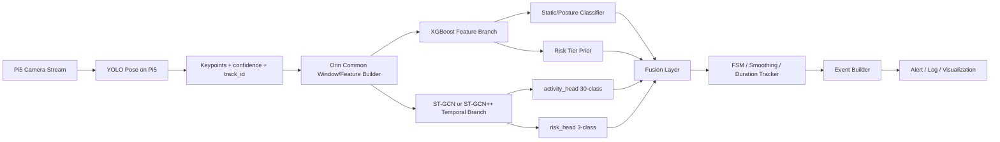
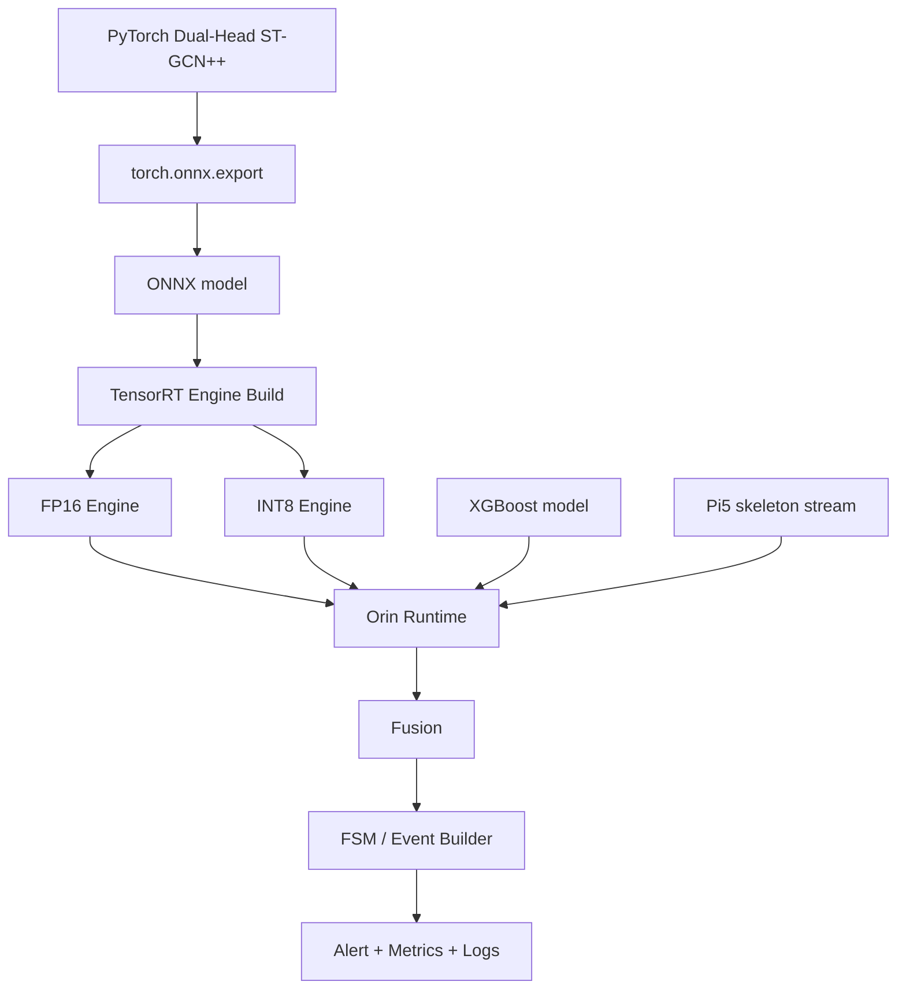

# Pi5–Orin 듀얼 브랜치 행동·위험 인식 아키텍처 자료 조사

## Executive summary

사용자 문서에 따르면 현재 목표 구조는 **Pi5에서 YOLO-Pose로 skeleton을 추출**하고, **Orin에서 공통 Window/Feature Builder**를 거쳐 **XGBoost 분기**와 **ST-GCN 분기**를 병렬 운용한 뒤 **FSM/Smoothing/Event Builder**로 이벤트를 정리하는 형태입니다. 또한 최종 목표는 소수 행동 분류가 아니라 **약 30개 수준의 일상행동 라벨**과 **위험도 3단계**를 함께 다루는 구조입니다. 이 전제에서 가장 타당한 결론은, **ST-GCN 계열을 없애고 XGBoost로 대체하는 것이 아니라**, **XGBoost를 정적 자세·짧은 구간 위험 추정용 보조 분기**로 확정하고, **일상행동 30-class의 주 분류기는 ST-GCN 또는 ST-GCN++ 같은 skeleton temporal 모델**로 유지하는 것입니다. 즉, 설계의 핵심은 “백본 교체”가 아니라 **분기 역할 분담의 명확화**입니다. fileciteturn0file3 citeturn38academia3turn49view0turn44academia0

공식·원문 기준으로 보면, ST-GCN 원논문은 skeleton을 그래프로 보고 시공간 패턴을 학습하는 기본 틀을 제시했고, OpenMMLab MMAction2와 PYSKL은 이를 실제 학습·평가 가능한 형태로 유지·확장하고 있습니다. 특히 MMAction2의 공개 벤치마크에서는 **ST-GCN++가 ST-GCN보다 더 적은 FLOPs·파라미터로 경쟁력 있는 정확도**를 보여, Edge 배포 관점에서 ST-GCN++가 우선 검토 대상입니다. 반면 XGBoost는 공식 문서상 multiclass probability 출력(`multi:softprob`), CPU/GPU 실행 선택(`device`), `hist` 기반 빠른 tree 구축을 지원하므로, **짧은 window에서 추출한 기하·속도·품질 feature**를 바탕으로 **정적 자세 분류**와 **빠른 위험도 prior**를 제공하는 역할에 적합합니다. citeturn46view3turn46view0turn49view0turn50view0turn44academia0

논문 기준으로 **사용자 목표와 정확히 동일한 “activity_head 30-class + risk_head 3-class” ST-GCN 표준 레시피**를 검증 가능한 1차 출처에서 확인하지는 못했습니다. 다만 **AS-GCN은 recognition head와 병렬의 future pose prediction head**를 사용했고, **MS²L은 motion prediction·jigsaw·contrastive learning을 함께 묶는 multi-task skeleton 학습**을 제안했습니다. 따라서 **shared temporal backbone + multiple heads**라는 발상 자체는 논문적으로 충분히 뒷받침되며, 사용자의 `activity_head + risk_head` 설계는 **표준 구현을 약간 확장한, 합리적인 엔지니어링 변형**으로 보는 것이 정확합니다. citeturn52academia3turn44academia1

배포 측면에서는 Jetson Orin Nano Developer Kit 공식 가이드가 **최대 67 INT8 TOPS**, **최대 102 GB/s 메모리 대역폭**, **7W–25W 전력 범위**를 명시하고 있고, PyTorch는 현재 **`torch.onnx.export(..., dynamo=True)`를 권장 ONNX export 경로**로 안내합니다. 이어 TensorRT는 **dynamic shape + optimization profile** 기반 엔진 빌드를, ONNX Runtime TensorRT EP는 **FP16/INT8, engine cache, timing cache, CUDA fallback** 구성을 공식 지원합니다. 즉, Orin 최적화의 실무 경로는 **PyTorch → ONNX → TensorRT 또는 ONNX Runtime TensorRT EP**가 현재 가장 표준적입니다. citeturn15view2turn36view1turn36view2turn15view0turn6view2turn37view3turn37view4turn16view0

아래 표는 이 조사 결과를 바탕으로 한 **최종 권장 결정**입니다.

| 영역 | 최종 권장 | 이유 |
|---|---|---|
| 자세·정적 위험 | **XGBoost 유지** | 짧은 window의 기하·속도 feature에 강하고, 빠른 추론과 해석이 가능함. multiclass probability 출력도 공식 지원함. citeturn46view3turn5view1turn28academia0turn29academia0 |
| 일상행동 30-class | **ST-GCN 또는 ST-GCN++ 유지** | 시계열 skeleton 패턴을 직접 모델링하며, 공식 구현과 벤치마크가 풍부함. citeturn38academia3turn49view0turn44academia0 |
| Edge 기본 백본 | **ST-GCN++ 우선** | MMAction2 기준으로 ST-GCN 대비 더 가벼운 FLOPs/params로 경쟁력 있는 성능을 보임. citeturn50view0 |
| 데이터 포맷 | **MMAction2/PYSKL 호환 포맷 채택** | `keypoint`, `keypoint_score`, `split`, `annotations` 구조가 이미 정립돼 있어 재사용성이 높음. citeturn53view0turn41view1 |
| 위험도 추론 | **Dual-head + late fusion + FSM** | 모델 출력만으로 이벤트를 확정하지 않고, 시간 지속성과 규칙 기반 추적기로 false alarm을 억제하기 좋음. 이는 본 프로젝트 구조와 action segmentation literature의 방향과도 부합함. fileciteturn0file3 citeturn26academia1turn25academia0 |
| Orin 배포 | **ONNX/TensorRT FP16 먼저, INT8는 검증 후** | 공식적으로 FP16/INT8 지원, dynamic shapes·cache·profiling 가이드가 잘 갖춰져 있음. citeturn37view2turn15view0turn37view3turn37view4turn16view0 |

## 권장 아키텍처와 설계 결론

이 구조는 **두 모델이 서로 경쟁하는 구조**가 아니라, **시간 스케일이 다른 두 추론기**가 서로 보완하는 구조로 바꿔 이해해야 합니다. XGBoost는 “프레임 몇 장에서 거의 바로 알 수 있는 것”을 맡고, ST-GCN은 “행동 의미를 알려면 최소 수십 프레임의 시간 문맥이 필요한 것”을 맡습니다. 사용자의 30개 일상행동 목표를 생각하면, `standing`, `sitting`, `lying_rest` 같은 정적 클래스만으로는 충분하지 않고, `sit_down`, `stand_up`, `walk`, `bend`, `reach`, `stumble`, `fall_like_transition` 같은 **전이와 패턴**이 들어가야 하므로 temporal branch는 필수입니다. fileciteturn0file3 citeturn38academia3turn49view0turn53view0



공통 Window/Feature Builder는 이 구조의 핵심입니다. 이 모듈은 단순 버퍼가 아니라, **동일 skeleton 스트림에서 XGBoost용 short-window feature와 ST-GCN용 long clip을 동기화해서 만드는 공통 전처리 계층**이어야 합니다. Ultralytics는 pose 추론 결과에서 `keypoints.xy`, `keypoints.xyn`, `keypoints.data`, `boxes`를 제공하므로, 여기서 **track_id 정합**, **누락 키포인트 보간**, **좌표 정규화**, **FPS 재샘플링**, **multi-person 처리 정책**을 한 번만 정의해야 합니다. MMAction2는 skeleton 학습 파이프라인에서 `PreNormalize2D`, `UniformSampleFrames`, `FormatGCNInput`, `GenSkeFeat` 같은 단계를 사용하므로, 커스텀 파이프라인도 이 구조를 참조하는 편이 가장 안전합니다. citeturn7view1turn41view1turn41view2turn53view0

사용자 구조에 가장 잘 맞는 권장 동작 분담은 아래와 같습니다.

| 단계 | 입력 | 권장 처리 | 출력 | 지연 목표 |
|---|---|---|---|---|
| Pi5 Pose | RGB 프레임 | YOLO pose 추론, 단일/다중 인물 skeleton 추출 | `(x, y, conf)` keypoints, bbox, track_id | 프레임당 즉시 |
| Window Builder | skeleton stream | 정규화, 결측 보정, short/long window 생성 | `feature_vector`, `clip_tensor` | 수 ms 수준 |
| XGBoost branch | short window | 정적 자세·전이 초기 위험 prior | posture probs, risk prior | 매우 짧음 |
| ST-GCN branch | long clip | 30-class 행동 + 3-class 위험도 동시 예측 | activity probs, risk probs | window 단위 |
| Fusion | 두 branch 확률 | 신뢰도·motion regime 기반 late fusion | fused activity/risk | 낮음 |
| FSM/Event | fused probabilities | 히스테리시스, duration tracking, event 묶기 | 최종 이벤트 | 낮음 |

이 중 가장 중요한 설계 원칙은 **행동 라벨은 ST-GCN을 주 경로로 두고, XGBoost는 stance prior/override로만 쓰는 것**입니다. 예를 들어 `walking`, `sit_down`, `stand_up`, `reaching`, `stumble`, `fall_transition`는 XGBoost로 억지로 해결하지 말고 ST-GCN 주 경로에서 결정해야 합니다. 반대로 `standing`, `sitting`, `lying_rest`처럼 거의 정적인 상태는 XGBoost가 더 빠르고, 데이터가 적을 때도 안정적일 수 있습니다. 이 분업은 공식 벤치마크·구현과 사용자의 구조 목표를 동시에 만족시키는 가장 현실적인 절충안입니다. fileciteturn0file3 citeturn38academia3turn44academia0turn28academia0turn29academia0

COCO 17-joint 체계를 기준으로 가는 것이 유리합니다. MMAction2 ST-GCN++ config는 `graph_cfg=dict(layout='coco', mode='spatial')`를 쓰고, 2D skeleton annotation에서 **17개 COCO keypoint**를 전제로 합니다. 사용자가 Pi5에서 YOLO-Pose를 쓰는 현재 방향과 직접 맞물리므로, **YOLO-Pose 출력의 17-keypoint skeleton을 그대로 temporal branch에 연결**하는 것이 추가 변환 오차를 줄이는 경로입니다. citeturn41view2turn53view0turn7view1

## 핵심 자료와 구현 스택

가장 먼저 봐야 할 자료는 공식·원문·유지보수 구현체 순으로 정리하는 것이 좋습니다. 아래 목록은 **우선순위가 높은 자료**만 남긴 것입니다.

| 우선순위 | 자료 | 왜 먼저 봐야 하나 |
|---|---|---|
| 최상 | **ST-GCN 원논문** | skeleton action recognition의 기본 수학적 틀과 문제 정의의 출발점입니다. citeturn38academia3 |
| 최상 | **MMAction2 skeleton model zoo** | ST-GCN/ST-GCN++ 공개 성능, config, ckpt, 학습·테스트 예제가 한곳에 있습니다. citeturn49view0turn50view0 |
| 최상 | **MMAction2 skeleton dataset README** | annotation 포맷, `keypoint` shape, `keypoint_score`, preprocessed dataset 링크가 명시돼 있습니다. citeturn53view0 |
| 최상 | **PYSKL 논문** | skeleton action recognition toolbox 비교 기준과 ST-GCN++의 배경을 줍니다. citeturn44academia0 |
| 높음 | **AS-GCN** | recognition head와 병렬 auxiliary head를 실제로 둔 예시라 multi-head 설계 참고에 좋습니다. citeturn52academia3 |
| 높음 | **MS²L** | skeleton representation에 대해 multi-task learning이 유효하다는 근거를 제공합니다. citeturn44academia1 |
| 높음 | **TCN 원논문** | 시계열 모델 대안으로 TCN을 검토할 때 가장 기본이 되는 자료입니다. citeturn26academia0 |
| 높음 | **MS-TCN** | 긴 스트림의 action segmentation과 over-segmentation 억제에 직접 관련 있습니다. citeturn26academia1 |
| 높음 | **XGBoost 공식 파라미터 문서** | multiclass objective, CPU/GPU, `hist`, subsampling, column sampling의 기준 문서입니다. citeturn5view1turn46view0turn46view1turn46view2turn46view3 |
| 높음 | **Ultralytics pose docs** | Pi5 YOLO-Pose 출력 필드와 export 가능 포맷을 공식적으로 확인할 수 있습니다. citeturn7view1turn37view2 |
| 높음 | **PyTorch ONNX docs** | `torch.onnx.export`의 최신 권장 방식과 dynamic shapes 설정을 제공합니다. citeturn36view1turn36view2 |
| 높음 | **NVIDIA Jetson/TensorRT 공식 문서** | Orin 전력/성능과 TensorRT 최적화 방법의 기준 문서입니다. citeturn15view2turn15view0turn16view0turn6view2turn37view3turn37view4 |

실제로 어떤 temporal backbone을 쓰는 게 맞는지는 “정확도만”이 아니라 **Edge trade-off**로 봐야 합니다. MMAction2 벤치마크에서 NTU60 XSub 2D 기준으로 ST-GCN joint stream은 **Top-1 88.95 / 3.8G FLOPs / 3.1M params**, ST-GCN++ joint stream은 **Top-1 89.29 / 1.95G FLOPs / 1.39M params**를 기록했습니다. Bone stream에서도 ST-GCN++는 **92.30**으로 ST-GCN의 **91.69**보다 높았습니다. 이 수치는 데이터셋 특화 결과이므로 절대값 그대로 이식하면 안 되지만, **“ST-GCN++가 더 가볍고 경쟁력 있다”는 방향성**은 꽤 강한 근거가 됩니다. citeturn49view0turn50view0

아래는 사용자의 목적에 맞춘 백본 비교입니다.

| 백본 | 강점 | 약점 | 이 프로젝트에서의 위치 |
|---|---|---|---|
| **ST-GCN** | 가장 표준적인 skeleton action baseline, 구현자료 많음 | Edge 기준으로 더 가벼운 대안이 존재 | 최소 기준선, 재현용으로 적합. citeturn38academia3turn49view0 |
| **ST-GCN++** | ST-GCN보다 경량·고효율, PYSKL/MMAction2 지원 | 멀티헤드 커스텀 구현은 직접 수정 필요 | **가장 추천**. 사용자의 Orin 환경과 잘 맞음. citeturn44academia0turn50view0turn42view0 |
| **TCN / MS-TCN** | long stream segmentation·smoothing에 강함, FSM 대체/보완 가능 | skeleton graph 구조를 직접 쓰지 않음 | 프레임 단위 상태 segmentation이 더 중요할 때 대안. citeturn26academia0turn26academia1turn25academia0 |
| **LSTM 계열** | 구현 단순, 소규모 데이터에서 출발 쉬움 | 현재 skeleton benchmark 주류는 아님 | baseline/ablation 용도. 주력 추천은 아님. citeturn26academia2turn26academia3 |

정리하면, **기본 선택지는 ST-GCN++**, **차선은 ST-GCN**, **프레임-레벨 segmentation이 더 중요하면 MS-TCN**, **데이터가 매우 적거나 빨리 baseline만 필요하면 LSTM**입니다. 특히 사용자가 이미 “공통 Window/Feature Builder + XGBoost + ST-GCN + FSM” 구조를 생각하고 있으므로, temporal branch를 없애는 대신 **ST-GCN++로 경량화**하는 편이 구조 일관성과 배포 현실성을 같이 잡습니다. fileciteturn0file3 citeturn44academia0turn50view0turn26academia1

## XGBoost 정적 자세·위험 분기 설계

XGBoost는 이 프로젝트에서 **정적 자세 추정기**이자 **위험 prior 생성기**로 보는 것이 맞습니다. 공식 문서 기준으로 XGBoost는 `multi:softprob`를 통해 클래스별 확률을 직접 낼 수 있고, `device`를 `cpu` 또는 `cuda`로 선택할 수 있으며, 현재 기본 tree method는 `hist`입니다. 또 `subsample`, `colsample_bytree`, `reg_lambda`, `reg_alpha`, `max_depth` 같은 파라미터로 과적합 제어가 가능합니다. 이는 짧은 window에서 수십 개 handcrafted feature를 넣는 자세/위험 분기에 매우 잘 맞습니다. citeturn5view1turn46view0turn46view1turn46view2turn46view3turn46view4

연구 사례로는, 최근 스마트 워커 환경의 skeleton posture classification에서 **Geometric approach와 XGBoost가 강한 성능**을 보였고, 일반 HAR 문맥에서도 XGBoost는 높은 accuracy/F1과 좋은 계산 효율을 보였습니다. 직접적인 “CCTV 2D 포즈 기반 30-class 행동”과 완전히 같은 조건은 아니지만, **“짧은 구간 geometry/kinematics로 posture를 구분하는 문제”에는 XGBoost가 충분히 경쟁력 있다**는 점은 확인됩니다. 따라서 `standing`, `sitting`, `lying_rest`, `leaning`, `bending_static` 같은 **자세형 클래스**와 `NORMAL/SUSPECT/DANGER`의 **짧은 구간 위험 prior**는 XGBoost에 맡기는 것이 합리적입니다. citeturn29academia0turn28academia0

권장 feature는 아래처럼 구성하는 것이 좋습니다. 아래 표는 **필수 템플릿**이며, 사용자 데이터에서 중요도가 낮은 항목은 제거하면 됩니다. 이것은 사용자 구조와 pose literature를 바탕으로 한 **권장 engineering template**입니다. fileciteturn0file3 citeturn7view1turn28academia3turn29academia0

| 묶음 | 필수 feature 예시 | 사용 이유 |
|---|---|---|
| 품질 | mean/min keypoint confidence, missing joint ratio, low-conf joint count | pose 품질이 나쁘면 위험 prediction 불안정성이 커짐 |
| 정규화 | torso length, bbox height/width, hip center, image-relative center_y | 카메라 거리 차이를 줄이기 위함 |
| 정적 기하 | torso angle to vertical, neck-hip slope, hip-knee angle, knee-ankle angle, shoulder width, hip width, feet distance, body aspect ratio | standing/sitting/lying/bending 구분의 핵심 |
| 높이 구조 | head_y, shoulder_y, hip_y, knee_y, ankle_y의 정규화 높이, head-to-ankle span | lying / slump / sit posture 분리에 유용 |
| 좌우 대칭 | left-right shoulder/hip/knee/ankle height diff, angle diff | 비정상 자세·기울어짐 탐지에 유리 |
| 짧은 움직임 | centroid vx/vy, pelvis vy, head vy, torso angular velocity, acceleration, jerk | 넘어짐/비틀거림/앉기·서기 전이 구분 |
| 요약 통계 | mean/std/min/max/p95/last/last-minus-first | 트리 모델이 window 전체 패턴을 간접 활용 가능 |
| 파생 score | lying score, sit score, abrupt_drop score, instability score | 규칙적으로 강한 신호를 tree가 쉽게 쓰게 함 |

window 길이는 **짧게** 가져가야 합니다. 사용자 프로젝트 문맥과 HAR window 연구를 함께 보면, XGBoost 분기에는 **약 0.5–1.0초**의 posture window가 가장 현실적이고, 위험 전이 prior를 조금 더 안정적으로 보고 싶으면 **0.8–1.6초**까지 늘릴 수 있습니다. 반대로 2–3초 이상으로 늘리면 feature branch가 temporal model과 역할이 겹치기 시작합니다. 이 권장은 현재 프로젝트가 이미 짧은 window 기반 feature 추론을 상정하고 있다는 점과, HAR에서 짧은 관측 구간이 높은 성능을 낼 수 있다는 연구를 함께 고려한 **실무적 추론**입니다. fileciteturn0file3 citeturn48academia1turn41view1

| 목적 | 30 FPS 기준 권장 window | 15 FPS 기준 권장 window | stride |
|---|---|---|---|
| 정적 posture | 16–32 frame | 8–16 frame | 4–8 frame |
| 위험 prior | 24–48 frame | 12–24 frame | 4–8 frame |
| fallback only | 8–16 frame | 4–8 frame | 2–4 frame |

아래 스니펫은 **YOLO pose keypoints `(x, y, conf)` 배열**에서 XGBoost용 feature를 만드는 최소 템플릿입니다. 입력은 `shape = [T, V, 3]`를 가정합니다. Ultralytics는 keypoints와 confidence를 직접 제공하므로 이 형식으로 저장하기 쉽습니다. citeturn7view1

```python
import numpy as np
from typing import Dict

# COCO 17-joint indices (예시)
NOSE = 0
L_SHOULDER, R_SHOULDER = 5, 6
L_HIP, R_HIP = 11, 12
L_KNEE, R_KNEE = 13, 14
L_ANKLE, R_ANKLE = 15, 16

def _safe_norm(v: np.ndarray, eps: float = 1e-6) -> float:
    return float(np.sqrt((v * v).sum()) + eps)

def _angle_deg(a: np.ndarray, b: np.ndarray, c: np.ndarray) -> float:
    # angle ABC
    ba = a - b
    bc = c - b
    denom = _safe_norm(ba) * _safe_norm(bc)
    cosv = np.clip(float(np.dot(ba, bc) / denom), -1.0, 1.0)
    return float(np.degrees(np.arccos(cosv)))

def build_xgb_features(seq_tvc: np.ndarray) -> Dict[str, float]:
    """
    seq_tvc: [T, V, 3] with x, y, conf
    returns: flat feature dict for XGBoost
    """
    xy = seq_tvc[..., :2].astype(np.float32)          # [T, V, 2]
    conf = seq_tvc[..., 2].astype(np.float32)         # [T, V]

    # torso center / size
    shoulder_mid = (xy[:, L_SHOULDER] + xy[:, R_SHOULDER]) / 2.0
    hip_mid = (xy[:, L_HIP] + xy[:, R_HIP]) / 2.0
    torso_vec = shoulder_mid - hip_mid
    torso_len = np.linalg.norm(torso_vec, axis=1) + 1e-6

    # normalize by torso length
    xy_norm = xy.copy()
    xy_norm[..., 0] -= hip_mid[:, None, 0]
    xy_norm[..., 1] -= hip_mid[:, None, 1]
    xy_norm /= torso_len[:, None, None]

    # geometric features from last frame
    last = xy_norm[-1]
    torso_last = shoulder_mid[-1] - hip_mid[-1]
    torso_angle_to_vertical = float(np.degrees(np.arctan2(torso_last[0], -(torso_last[1] + 1e-6))))

    l_knee_angle = _angle_deg(last[L_HIP], last[L_KNEE], last[L_ANKLE])
    r_knee_angle = _angle_deg(last[R_HIP], last[R_KNEE], last[R_ANKLE])

    feet_dist = _safe_norm(last[L_ANKLE] - last[R_ANKLE])
    shoulder_width = _safe_norm(last[L_SHOULDER] - last[R_SHOULDER])

    # simple motion features
    hip_mid_norm = np.stack([
        np.zeros_like(hip_mid[:, 0]),
        np.zeros_like(hip_mid[:, 1])
    ], axis=-1)
    hip_mid_norm[:, 1] = 0.0  # already centered; keep explicit for readability

    centroid = xy_norm.mean(axis=1)                   # [T, 2]
    vel = np.diff(centroid, axis=0, prepend=centroid[:1])
    acc = np.diff(vel, axis=0, prepend=vel[:1])

    head_y = xy_norm[:, NOSE, 1]
    pelvis_y = np.zeros_like(head_y)                  # hip-mid centered
    head_drop = np.diff(head_y, prepend=head_y[:1])

    # confidence quality
    mean_conf = float(conf.mean())
    min_conf = float(conf.min())
    low_conf_ratio = float((conf < 0.3).mean())

    feats = {
        "torso_angle_last": torso_angle_to_vertical,
        "knee_angle_left_last": l_knee_angle,
        "knee_angle_right_last": r_knee_angle,
        "feet_dist_last": feet_dist,
        "shoulder_width_last": shoulder_width,
        "head_y_last": float(head_y[-1]),
        "head_y_mean": float(head_y.mean()),
        "head_y_std": float(head_y.std()),
        "head_drop_max": float(head_drop.max()),
        "centroid_vx_mean": float(vel[:, 0].mean()),
        "centroid_vy_mean": float(vel[:, 1].mean()),
        "centroid_speed_p95": float(np.percentile(np.linalg.norm(vel, axis=1), 95)),
        "centroid_acc_p95": float(np.percentile(np.linalg.norm(acc, axis=1), 95)),
        "mean_conf": mean_conf,
        "min_conf": min_conf,
        "low_conf_ratio": low_conf_ratio,
    }
    return feats
```

XGBoost 하이퍼파라미터는 아래 범위에서 시작하면 됩니다. 여기서 수치는 **권장 탐색 범위**이며, 의미와 지원 여부 자체는 XGBoost 공식 문서에 근거합니다. 특히 `tree_method='hist'`와 `device='cpu' or 'cuda'`, `multi:softprob`, `subsample`, `colsample_bytree`, `max_depth`, `reg_alpha`, `reg_lambda`는 공식적으로 정의돼 있습니다. Orin에서는 **처음에는 CPU로 두고**, GPU는 ST-GCN/TensorRT에 양보한 뒤 **프로파일링 결과 CPU가 병목일 때만 `device='cuda'`를 검토**하는 편이 보수적으로 맞습니다. 이 마지막 조언은 XGBoost의 장치 옵션과 Jetson의 GPU 공유 현실을 결합한 엔지니어링 추론입니다. citeturn46view0turn46view1turn46view2turn46view3turn46view4turn15view2

| 항목 | 권장 시작값 | 비고 |
|---|---|---|
| objective | `multi:softprob` | posture 또는 risk multiclass 확률 출력 |
| tree_method | `hist` | 빠른 학습/추론 출발점 citeturn46view0 |
| device | `cpu` 시작, 필요 시 `cuda` | 공식 지원됨 citeturn46view3 |
| max_depth | 4–8 | 깊어질수록 과적합·메모리 증가 경향 citeturn46view4 |
| eta | 0.03–0.1 | 일반적인 탐색 구간 |
| subsample | 0.7–1.0 | 과적합 억제에 유용 citeturn46view1 |
| colsample_bytree | 0.6–0.9 | feature 과적합 억제 citeturn46view2 |
| reg_alpha | 0–1 | sparsity 유도 |
| reg_lambda | 1–5 | 보수적 모델 유도 citeturn46view2 |

fusion 전에 확률 보정이 필요하면 `CalibratedClassifierCV`를 쓰는 것이 안전합니다. 공식 문서에 따르면 calibration은 `decision_function` 또는 `predict_proba` 기반으로 수행되며, `sigmoid`, `isotonic`, `temperature`를 지원합니다. 문서상 **매우 불균형한 데이터셋에서는 sigmoid가 선호될 수 있고**, **isotonic은 calibration sample이 매우 적으면 과적합 위험**이 큽니다. 따라서 risk tier처럼 클래스 불균형이 심한 경우엔 **sigmoid부터 시작**하는 것이 실무적으로 낫습니다. citeturn12view0turn12view1turn12view2

## ST-GCN 일상행동·위험 분기 설계

일상행동 30-class는 **시계열이 필요합니다**. ST-GCN 계열은 바로 이 부분을 해결하기 위해 만들어졌습니다. ST-GCN 원논문은 skeleton의 공간 구조와 시간 변화를 함께 학습하는 graph convolution을 제안했고, MMAction2/PYSKL은 이를 실제 학습 가능한 엔진으로 제공합니다. 따라서 `walking`, `sit_down`, `stand_up`, `reaching`, `bending`, `stumble`, `fall_transition`, `turning`, `pick_up` 같은 **동작 의미가 시간 문맥에 의존하는 클래스**는 ST-GCN 분기에서 처리해야 합니다. 이는 사용자의 현재 구조 의도와도 일치합니다. citeturn38academia3turn49view0turn44academia0turn53view0

MMAction2의 공식 skeleton annotation 포맷은 `split`과 `annotations` 두 필드를 가지며, 각 annotation은 `frame_dir`, `total_frames`, `label`, `keypoint`, `keypoint_score` 등을 포함합니다. 특히 2D skeleton에서 `keypoint`의 shape은 **`[M x T x V x C]`**, `keypoint_score`는 **`[M x T x V]`**입니다. 여기서 `M`은 person 수, `T`는 frame 수, `V`는 joint 수, `C=2`는 2D 좌표입니다. 사용자의 커스텀 데이터도 **중간 라벨링 단계에서는 JSON으로 관리하더라도**, 최종 학습 입력은 이 포맷에 맞춰 `.pkl`로 변환하는 것이 가장 재사용성이 높습니다. citeturn53view0

MMAction2의 ST-GCN/ST-GCN++ 예제는 2D COCO skeleton에 대해 `UniformSampleFrames(clip_len=100)`와 `FormatGCNInput(num_person=2)`를 사용합니다. 또한 ST-GCN++ config는 `graph_cfg=dict(layout='coco', mode='spatial')`, `cls_head=dict(type='GCNHead', num_classes=60, in_channels=256)`를 보여줍니다. 이 구조는 사용자의 경우 `num_classes=30`으로 바꾸고, 여기에 `risk_head=3`을 병렬 추가하면 됩니다. 즉, **백본은 그대로 두고 head만 두 개로 늘리는 방식**이 가장 자연스럽습니다. citeturn41view1turn41view2turn42view0

아래는 그 구조를 단순화한 예시입니다. 이 코드는 “공식 구현을 그대로 복붙한 것”은 아니고, **shared backbone + dual heads**라는 설계 원칙을 PyTorch 스타일로 풀어쓴 것입니다. 그 설계 타당성은 ST-GCN/ST-GCN++ 공식 구현과 multi-head/multi-task skeleton 논문들로 뒷받침됩니다. citeturn41view2turn52academia3turn44academia1

```python
import torch
import torch.nn as nn

class DualHeadSTGCN(nn.Module):
    def __init__(self, backbone: nn.Module, feat_dim: int = 256,
                 num_activity: int = 30, num_risk: int = 3):
        super().__init__()
        self.backbone = backbone
        self.pool = nn.AdaptiveAvgPool2d((1, 1))
        self.activity_head = nn.Linear(feat_dim, num_activity)
        self.risk_head = nn.Linear(feat_dim, num_risk)

    def forward(self, x):
        """
        x: backbone 입력 tensor
        backbone 출력은 [N, C, T, V] 형태를 가정
        """
        feat = self.backbone(x)            # [N, C, T, V]
        feat = self.pool(feat).flatten(1)  # [N, C]
        act_logits = self.activity_head(feat)
        risk_logits = self.risk_head(feat)
        return {
            "activity_logits": act_logits,
            "risk_logits": risk_logits,
            "feat": feat
        }

def compute_loss(outputs, y_act, y_risk, act_weight=None, risk_weight=None,
                 lambda_risk: float = 0.5):
    ce_act = nn.CrossEntropyLoss(weight=act_weight)
    ce_risk = nn.CrossEntropyLoss(weight=risk_weight)
    loss_act = ce_act(outputs["activity_logits"], y_act)
    loss_risk = ce_risk(outputs["risk_logits"], y_risk)
    total = loss_act + lambda_risk * loss_risk
    return total, {
        "loss_activity": loss_act.detach(),
        "loss_risk": loss_risk.detach(),
        "loss_total": total.detach()
    }
```

학습 시작점으로는 아래 구성이 무난합니다. 여기서 **SGD + momentum + weight_decay + cosine scheduler**는 MMAction2 ST-GCN++ config에 있는 실제 예시이고, class imbalance를 위한 `CrossEntropyLoss(weight=...)`는 PyTorch 공식 문서에 근거합니다. 반면 `lambda_risk`, clip range, label smoothing 값 등은 **실무 시작점**이므로 검증셋에서 반드시 조정해야 합니다. citeturn42view0turn42view1turn32view0turn32view1turn32view2

| 항목 | 권장 시작점 | 근거 |
|---|---|---|
| 백본 | ST-GCN++ 우선, ST-GCN 차선 | MMAction2/PYSKL 성능·경량성 비교 citeturn50view0turn44academia0 |
| skeleton layout | COCO 17 joints, 2D + `keypoint_score` | MMAction2 config/annotation format citeturn41view2turn53view0 |
| clip 길이 | 64 또는 100 frame | 공식 예제는 100 frame, Edge 지연 줄이려면 64도 현실적 citeturn41view1turn49view0 |
| optimizer | SGD, lr 0.05–0.1, momentum 0.9, wd 5e-4 | MMAction2 ST-GCN++ 예제 참고 citeturn42view0turn42view1 |
| loss | `L = L_activity + λ * L_risk` | multi-head shared backbone 설계 |
| λ | 0.3–0.7 탐색 | risk head가 activity를 덮지 않게 시작 |
| imbalance 처리 | class-weighted CE, 필요 시 focal 대체 | PyTorch CE weight 지원 citeturn32view0turn32view1 |
| label smoothing | 0–0.05 시작 | 공식 옵션 지원, 과신 완화 가능 citeturn32view2 |

multi-head의 근거는 분명합니다. **AS-GCN은 action recognition head와 병렬의 future pose prediction head**를 추가했고, **MS²L은 motion prediction·jigsaw·contrastive learning을 동시에 활용**했습니다. 즉, skeleton backbone에 task를 하나만 붙여야 한다는 제약은 없습니다. 다만 공개 1차 자료에서 **정확히 ‘activity 30-class + risk 3-class’ 구조를 표준화한 구현은 확인하지 못했으므로**, 이 부분은 **논문적 영감 + 프로젝트 요구를 결합한 커스텀 설계**라고 보는 것이 가장 정직합니다. citeturn52academia3turn44academia1

시계열 대안도 명확히 이해할 필요가 있습니다. **TCN**은 sequence modeling에서 recurrent network를 대체할 수 있다는 강한 결과를 보여 주었고, **MS-TCN**은 long stream에서 over-segmentation을 줄이기 위한 smoothing loss를 도입했습니다. 반면 **LSTM 계열**은 여전히 유효하지만, skeleton action recognition의 최신 주류는 GCN/TCN 쪽에 가깝습니다. 따라서 사용자의 목적이 “행동 라벨 30개 + risk 3개 + edge 배포”라면, **ST-GCN++를 주축**, **FSM 또는 MS-TCN식 smoothing 아이디어를 후처리에 차용**, **LSTM은 baseline**으로 두는 구성이 가장 설득력 있습니다. citeturn26academia0turn26academia1turn26academia2turn26academia3

## 데이터셋과 라벨링 전략

데이터셋은 **사전학습/전이용 대형 skeleton benchmark**와 **도메인 적합성 검증용 낙상·실내 행동 데이터**를 분리해서 봐야 합니다. ST-GCN 계열의 기본기는 NTU/PKU에서 익히고, 실제 프로젝트 튜닝은 사용자의 장면·카메라·연령대·행동 분포에 맞는 데이터로 가야 합니다. citeturn17academia1turn17academia0turn18academia0

| 데이터셋 | 추천 용도 | 핵심 특성 |
|---|---|---|
| **NTU RGB+D 60** | skeleton backbone 사전학습/전이 | 56k+ 샘플, 60 action, 40 subjects, daily/mutual/health-related action 포함. citeturn17academia1 |
| **NTU RGB+D 120** | 라벨 다양성 확장 전이 | 114k+ 샘플, 120 action, 106 subjects. 더 많은 일상/상호작용 클래스를 포함. citeturn17academia0 |
| **PKU-MMD** | continuous action detection / event AP 평가 | 1,076 long sequences, 51 classes, ~20k instances, skeleton 포함. 연속 비디오에서 시작·끝 이벤트 평가에 유리. citeturn18academia0 |
| **OpenMMLab skeleton annotation packs** | 빠른 실험 시작 | NTU60/120, UCF101, HMDB51, FineGYM용 preprocessed skeleton `.pkl` 제공. citeturn53view0 |
| **UP-Fall / UR-Fall / Le2i / FU-Kinect / ImVia** | 낙상·비정상위험 검증 | 최근 fall recognition 논문들이 반복 사용. 다만 배포 조건과 라벨 정의는 각각 상이해 라이선스·다운로드 경로 재확인이 필요. citeturn19academia1turn20academia0turn19academia3 |

국내 공개 자료에 대해서는, 이번 조사 범위 안에서 **“실내 고령자 일상행동 + 위험도 + skeleton sequence”를 정확히 만족하는 국내 공식 공개 페이지**를 검증 가능한 형태로 안정적으로 확인하지 못했습니다. 따라서 국내 데이터는 **기존 한국어 RGB/CCTV 데이터셋을 pose sequence로 재가공**하거나, **직접 수집**하는 쪽이 더 현실적입니다. 이 부분은 확인 가능한 근거가 부족하므로 단정하지 않겠습니다.

직접 수집을 한다면, skeleton 기반 프로젝트는 **원본 RGB보다 환경 편차에 민감하지 않다**고 알려져 있지만, 실제 배포에서는 여전히 카메라 높이·렌즈 왜곡·광량·가림·피사체 체형·보행보조기 사용 여부·침대/의자 높이 차이 등에서 도메인 갭이 발생합니다. 따라서 수집 시에는 **방 종류**, **카메라 높이**, **거리**, **조도**, **가림 정도**, **연령대/체형**, **보조기 사용**, **정상/위험 전이**를 stratified하게 구성해야 합니다. ST-GCN이 benchmark에서는 강해도 실제 현장에서는 데이터 수집 편향이 성능을 더 크게 좌우합니다. citeturn38academia3turn17academia0turn18academia0

사용자가 아직 구체적 30-class 목록을 확정하지 않았기 때문에, 아래처럼 **라벨 그룹 템플릿**부터 만드는 것이 좋습니다. 이것은 예시입니다.

| 그룹 | 예시 라벨 |
|---|---|
| 정적 자세 | `standing`, `sitting`, `lying_rest`, `leaning`, `bending_static` |
| 이동 행동 | `walking`, `turning`, `pacing`, `approach_bed`, `leave_bed` |
| 전이 행동 | `sit_down`, `stand_up`, `lie_down`, `get_up_from_bed`, `bend_down`, `rise_from_floor` |
| 상호작용 행동 | `pick_up`, `reach_high`, `reach_low`, `open_drawer`, `use_phone`, `drink`, `eat`, `dress` |
| 이상·위험 단서 | `stumble`, `slip_like`, `loss_of_balance`, `sudden_drop`, `fall_transition`, `post_fall_still` |

중간 라벨링 포맷은 JSON으로 관리하고, 학습 직전 MMAction2 호환 `.pkl`로 변환하는 방식을 추천합니다. 아래는 **행동 라벨 메타데이터 예시**입니다. 이 예시는 사용자 맞춤 포맷 제안이며, 최종적으로는 MMAction2의 `label` 정수 인덱스로 매핑해야 합니다. citeturn53view0

```json
{
  "label_map": {
    "standing": 0,
    "sitting": 1,
    "lying_rest": 2,
    "walking": 3,
    "sit_down": 4,
    "stand_up": 5,
    "bending": 6,
    "reaching": 7,
    "pick_up": 8,
    "fall_transition": 9
  },
  "risk_map": {
    "NORMAL": 0,
    "SUSPECT": 1,
    "DANGER": 2
  }
}
```

아래는 **skeleton sequence JSON 예시**입니다. 실제 학습기에는 이후 `annotations` 리스트와 `split` 딕셔너리를 가진 `.pkl`로 묶으면 됩니다. `keypoint` shape 설계는 MMAction2 공식 annotation 형식을 반영했습니다. citeturn53view0turn7view1

```json
{
  "frame_dir": "roomA_subject03_clip001",
  "total_frames": 90,
  "img_shape": [720, 1280],
  "original_shape": [720, 1280],
  "activity_label": "sit_down",
  "risk_label": "SUSPECT",
  "keypoint_format": "M x T x V x C",
  "score_format": "M x T x V",
  "keypoint": [
    [
      [[512.3, 201.1], [ ... 17 joints ... ]],
      [[513.0, 202.7], [ ... 17 joints ... ]]
    ]
  ],
  "keypoint_score": [
    [
      [0.98, 0.95, 0.92, 0.90, 0.91, 0.96, 0.97, 0.88, 0.85, 0.82, 0.80, 0.94, 0.95, 0.89, 0.88, 0.86, 0.85],
      [0.98, 0.95, 0.92, 0.90, 0.91, 0.96, 0.97, 0.88, 0.85, 0.82, 0.80, 0.94, 0.95, 0.89, 0.88, 0.86, 0.85]
    ]
  ],
  "track_id": 3
}
```

## Edge Orin 배포와 운영 검증

Jetson Orin Nano Developer Kit 공식 가이드는 현재 **최대 67 INT8 TOPS**, **최대 102 GB/s**, **7W–25W configurable power**를 제시합니다. 이 수치는 “무조건 빠르다”는 뜻이 아니라, **전력 모드와 thermal 상태에 따라 편차가 크므로 벤치마크를 엄격히 고정해야 한다**는 뜻입니다. TensorRT best practices도 벤치마킹을 최적화보다 먼저 하라고 강조하고, wall-clock/CUDA events/메모리 추적과 함께 **GPU clock, power, thermal throttling** 통제를 권장합니다. 따라서 Orin 실험은 **성능 최적화 이전에 측정 환경 고정**부터 해야 합니다. citeturn15view2turn16view0

배포 파이프라인은 아래가 가장 현실적입니다.



PyTorch 공식 문서에 따르면 ONNX export는 **`dynamo=True`가 현재 권장·기본 방식**이고, 동적 크기가 필요하면 `dynamic_shapes`를 쓰는 것이 바람직합니다. TensorRT는 dynamic shapes를 위해 입력 차원에 `-1` placeholder를 두고, **min/opt/max optimization profile**을 빌드 시 정의하라고 안내합니다. 그리고 ONNX Runtime TensorRT EP는 **`trt_fp16_enable`**, **`trt_int8_enable`**, **`trt_engine_cache_enable`**, **`trt_timing_cache_enable`**, **CUDA fallback**을 공식 옵션으로 제공합니다. 따라서 ST-GCN branch는 **window 길이와 person 수가 달라질 가능성**을 생각해 dynamic shape 프로파일을 꼭 준비해야 합니다. citeturn36view1turn36view2turn15view0turn37view3turn37view4

아래는 실제 export와 ORT-TensorRT 구성의 최소 예시입니다. 옵션 자체는 PyTorch/ONNX Runtime 공식 문서에 근거합니다. citeturn36view1turn36view2turn37view3turn37view4

```python
import torch
import onnxruntime as ort

model.eval()
dummy = torch.randn(1, 3, 64, 17)  # 예시 텐서, 실제 shape는 구현에 맞게 조정

torch.onnx.export(
    model,
    (dummy,),
    "dual_head_stgcn.onnx",
    input_names=["input"],
    output_names=["activity_logits", "risk_logits"],
    dynamo=True,
    dynamic_shapes={"input": {0: "batch", 2: "time"}}
)

providers = [
    ("TensorrtExecutionProvider", {
        "trt_fp16_enable": True,
        "trt_engine_cache_enable": True,
        "trt_engine_cache_path": "./trt_cache",
        "trt_timing_cache_enable": True,
        "trt_timing_cache_path": "./trt_cache",
        "trt_max_workspace_size": 2147483648
    }),
    ("CUDAExecutionProvider", {})
]

sess = ort.InferenceSession("dual_head_stgcn.onnx", providers=providers)
```

TensorRT EP cache는 **매우 중요**합니다. ONNX Runtime 문서에는 **cache 없을 때 warmup 384초**, **timing cache 42초**, **engine cache 9초**, **embedded engine 1.9초** 예시가 나옵니다. 또한 cache는 **모델, ORT 버전, TensorRT 버전, 하드웨어가 바뀌면 무효화해야 하고, 기기 간 portable하지 않다**고 명시합니다. 즉, Edge 현장에서는 **부팅 직후 warmup 지연**과 **버전 변경 시 cache invalidation**을 운영 체크리스트에 넣어야 합니다. citeturn6view3

YOLO pose 쪽은 Ultralytics 공식 docs가 pose 모델을 **ONNX, TensorRT engine, half, int8, dynamic, batch, workspace**로 export 가능하다고 명시합니다. 따라서 Pi5에서 pose까지 계속 돌릴지, 아니면 Orin으로 pose를 옮길지는 네트워크 예산과 전력 배분 문제입니다. 다만 사용자가 이미 Pi5에서 skeleton만 보내는 방향이라면, **프레임 전체를 보내지 말고 skeleton + confidence + track_id만 전송**하는 것이 대역폭·프라이버시·지연 면에서 일반적으로 유리합니다. 이 마지막 판단은 공식 출력 포맷과 구조적 특성을 바탕으로 한 엔지니어링 추론입니다. citeturn7view1turn37view2

Fusion과 FSM은 “이벤트 품질”을 좌우합니다. 가장 권장되는 패턴은 **activity는 ST-GCN 주도**, **risk는 motion regime에 따라 동적 가중 융합**, **최종 alert는 FSM이 시간 지속성을 확인한 뒤 발행**하는 것입니다. 논문적으로는 MS-TCN이 over-segmentation을 줄이기 위해 smoothing loss를 도입했고, skeleton action segmentation 연구도 multi-stage temporal refinement를 사용합니다. 사용자의 구조에서는 이를 모델 내부가 아니라 **후처리 FSM**으로 흉내 내면 됩니다. citeturn26academia1turn25academia0fileciteturn0file3

아래는 시작점으로 쓸 수 있는 fusion/FSM 패턴입니다. **수치는 검증 전 임시값**이며, 사실 주장이라기보다 디버깅용 추천값입니다.

| 상황 | activity decision | risk fusion | FSM 규칙 |
|---|---|---|---|
| motion 낮음, posture conf 높음 | XGBoost static class를 ST-GCN과 교차검증 | `risk = 0.7*xgb + 0.3*stgcn` | 0.5초 이상 지속 시 상태 전이 후보 |
| motion 중간 | ST-GCN 우선 | `risk = 0.5*xgb + 0.5*stgcn` | 1초 내 연속 상승 여부 확인 |
| motion 큼 / 전이 구간 | ST-GCN activity 우선 | `risk = 0.3*xgb + 0.7*stgcn` | 급락 + lying 후보 + stillness 결합 시 DANGER 후보 |
| post-fall stillness | `post_fall_still` 별도 event | ST-GCN risk + XGBoost lying prior 결합 | N초 지속 후 이벤트 확정 |

검증은 **분할 전략, 이벤트 지표, 운영 지표**를 분리해야 합니다. NTU는 cross-subject / cross-view, PKU-MMD는 연속 액션과 detection metric을 제안하므로, 프로젝트 데이터도 **subject split**, **camera/room split**, **session/date split**을 분리해야 leakage를 줄일 수 있습니다. 평가 지표는 class 불균형 때문에 단순 accuracy보다 **per-class F1**, **confusion matrix**, **event AP/mAP**, **latency p50/p95**, **GPU memory**, **warmup time**, **false alarms per hour/day**를 보는 편이 정확합니다. Scikit-learn 공식 문서에 따르면 F1은 precision과 recall의 조화평균이고, confusion matrix는 실제 class와 예측 class의 교차 계수를 직접 보여 주며, AP는 precision-recall curve를 요약합니다. citeturn17academia1turn18academia0turn10view0turn10view1turn10view2turn16view0

실무 체크리스트를 압축하면 아래와 같습니다.

| 항목 | 반드시 확인할 것 |
|---|---|
| 데이터 분할 | same subject / same day / same room leakage 방지 |
| 시나리오 테스트 | 정상 앉기/눕기 vs 위험 전이, 가림, 부분 몸체, 다중 인물, 야간 조도 |
| A/B 실험 | ST-GCN only vs XGBoost+ST-GCN vs +FSM |
| 품질 지표 | per-class F1, confusion matrix, event AP, false alarms/day |
| 성능 지표 | end-to-end latency p50/p95, branch별 latency, memory, warmup time |
| 안정성 지표 | missing keypoint ratio, branch disagreement rate, thermal throttling 여부 |
| 확률 보정 | calibration 전/후 risk threshold 변화 |
| 운영 로그 | event timeline, transition dwell time, dropped frame ratio |

추천 차트도 명확합니다. 사용자 보고서나 대시보드에는 **class별 F1 막대그래프**, **confusion matrix heatmap**, **latency waterfall**, **risk calibration/reliability plot**, **event timeline chart**를 넣는 것이 가장 도움이 됩니다. 이는 성능 비교와 임계값 조정을 동시에 가능하게 합니다. citeturn10view0turn10view1turn10view3turn12view2turn16view0

## 열린 질문과 한계

이번 조사에서 가장 중요한 한계는 두 가지입니다. 첫째, **사용자 프로젝트와 완전히 동일한 “2D CCTV pose → 30-class activity + 3-class risk dual-head ST-GCN” 공식 baseline**은 검증 가능한 1차 출처에서 확인하지 못했습니다. 다만 **parallel auxiliary head**와 **multi-task skeleton learning**의 근거는 충분하므로, 구조 자체가 비상식적이거나 무리한 설계는 아닙니다. citeturn52academia3turn44academia1

둘째, **국내 공개 데이터셋**은 접근 가능한 공식 검색 범위에서 사용자의 목적에 정확히 맞는 skeleton sequence 공개 자료를 안정적으로 검증하지 못했습니다. 따라서 국내 자료는 **직접 수집** 또는 **국내 RGB/CCTV 데이터의 skeleton 변환**이 더 현실적입니다. 이 부분은 확인 부족이므로 단정하지 않았습니다.

셋째, XGBoost posture 사례로 인용한 일부 최신 자료는 **아주 최근 arXiv 자료**를 포함합니다. 따라서 방향성 참고에는 유용하지만, 실제 현장 일반화 성능은 자체 검증이 필요합니다. 특히 recent paper가 보고한 높은 training 성능 수치는 그대로 운영 기대치로 받아들이면 안 됩니다. citeturn29academia0

가장 보수적이고 실무적인 최종 결론은 다음 한 줄로 요약됩니다. **사용자 구조는 유지하되, XGBoost를 “정적 posture/risk prior”, ST-GCN++를 “30-class temporal activity + risk main branch”, FSM을 “event quality controller”로 역할 고정**하는 것이 가장 합리적입니다. fileciteturn0file3 citeturn50view0turn46view3turn26academia1turn16view0