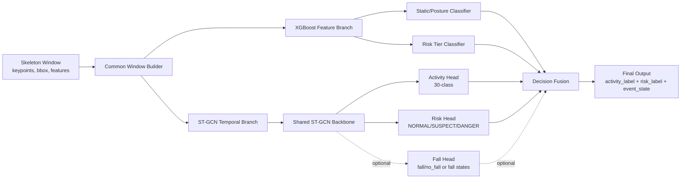

# XGBoost + ST-GCN 구조 변경 설계서

작성일: 2026-06-07  
대상 범위: **XGBoost 구조와 ST-GCN 구조만**  
목표: 기존 6개 coarse 행동 + 낙상 중심 구조를 **세부 행동 분류 + 위험도 분류 병렬 구조**로 변경한다.

---

## 1. 현재 구조의 핵심 문제

현재 프로젝트는 Pi5가 skeleton을 추출하고 Orin에서 XGBoost와 ST-GCN을 사용하는 구조로 이동하고 있다. 이 방향 자체는 맞다. 하지만 현재 모델 설계는 아직 다음 한계를 가진다.

1. **행동 라벨과 위험도 라벨이 명확히 분리되어 있지 않다.**
   - 행동은 `standing`, `walking`, `sitting_down` 같은 실제 동작이다.
   - 위험도는 `NORMAL`, `SUSPECT`, `DANGER` 같은 상태 등급이다.
   - 두 값을 하나의 출력처럼 다루면 생활 패턴 분석이 어려워진다.

2. **기존 ST-GCN은 낙상 refinement 용도에 가깝다.**
   - 현재 구조에서는 위험 후보가 생긴 뒤 ST-GCN을 실행하는 흐름이 중심이다.
   - 이 구조에서는 정상 일상행동인 `walking`, `sitting_down`, `standing_up` 같은 행동을 ST-GCN이 항상 분석하지 못한다.

3. **기존 6개 coarse 행동 라벨은 24시간 생활 패턴 분석에 부족하다.**
   - `STANDING`, `SITTING`, `LYING`, `WALKING`, `TRANSITION`, `UNKNOWN`만으로는 세부 타임라인을 만들기 어렵다.
   - 목표 구조에서는 정상 행동도 `NORMAL` 하나로 저장하지 않고 세부 행동 라벨과 함께 저장해야 한다.

---

## 2. 목표 구조 요약

XGBoost와 ST-GCN은 같은 입력 윈도우를 공유하되 서로 다른 강점을 담당한다.



핵심은 다음과 같다.

```text
XGBoost = feature 기반 빠른 정적/위험도 판단
ST-GCN = skeleton sequence 기반 시계열 행동/위험도 판단
FSM/Fusion = 두 모델 결과를 합쳐 최종 activity_label, risk_label, event_state 생성
```

---

## 3. XGBoost 구조 변경안

### 3.1 XGBoost에는 backbone이라는 표현을 쓰지 않는다

딥러닝 모델처럼 `backbone + head` 구조가 아니다. XGBoost는 사람이 설계한 feature vector를 받아 분류하는 모델이다. 따라서 다음 표현이 더 정확하다.

```text
XGBoost Feature Branch
 ├─ Static/Posture Classifier
 └─ Risk Tier Classifier
```

### 3.2 XGBoost Static/Posture Classifier

역할은 정적 자세와 짧은 윈도우 기반 자세를 빠르게 판단하는 것이다.

권장 출력 라벨 예시는 다음과 같다.

```text
standing
sitting
lying_rest
bending_candidate
no_move_candidate
unknown
```

처음부터 30개 전체를 XGBoost로 분류하지 않는 것이 좋다. XGBoost는 `sitting_down`, `standing_up`, `stumble`, `near_fall` 같은 시간 흐름 기반 행동을 안정적으로 분리하기 어렵다.

### 3.3 XGBoost Risk Tier Classifier

역할은 윈도우 요약 feature를 보고 위험도 등급을 빠르게 판단하는 것이다.

출력은 다음 3개로 고정한다.

```text
NORMAL
SUSPECT
DANGER
```

현재 이미 `tier_label` 기반 3-class XGBoost 모델 경로가 만들어진 상태라면, 이 모델은 유지하고 feature schema와 label meta를 더 엄격하게 관리하는 방향이 맞다.

### 3.4 XGBoost 입력 feature

XGBoost 입력은 ST-GCN의 raw sequence가 아니라 요약 feature다. 최소 feature set은 다음과 같다.

| 그룹 | feature 예시 |
|---|---|
| 자세 | torso_angle, knee_angle |
| bbox | aspect_ratio, bbox_area |
| 이동 | center_velocity, vertical_velocity |
| 변화량 | acceleration, jerk |
| 안정성 | instability, motion_energy |
| 지속 | static_duration |
| 품질 | pose_confidence, visible_joint_ratio |
| ROI | bed_overlap, floor_overlap |

feature는 반드시 `feature_names`와 순서를 meta 파일에 저장해야 한다.

### 3.5 XGBoost 구현 변경 파일

권장 파일 구조는 다음과 같다.

```text
server/services/model_input_window.py
server/services/xgboost_static_classifier.py
server/services/xgboost_tier_classifier.py
server/services/pi5_pipeline.py
shared/labels.py
edge/models/xgboost_static_posture.json
edge/models/xgboost_static_posture_meta.json
edge/models/xgboost_tier_multiclass.json
edge/models/xgboost_tier_multiclass_meta.json
```

기존 코드에서 `action_classifier.py`가 Pi5 또는 edge 쪽에 남아 있다면 운영 판단의 중심에서 제외한다. fallback 또는 디버그 용도로만 남기는 것이 안전하다.

### 3.6 XGBoost 학습 절차

```text
1. skeleton/window 로그 수집
2. window별 feature export
3. label_names와 feature_names 고정
4. static/posture 모델 학습
5. tier/risk 모델 학습
6. validation confusion matrix 확인
7. meta 파일 생성
8. Orin runtime 로드 테스트
```

권장 도구명은 다음과 같다.

```text
tools/export_xgboost_static_features.py
tools/train_xgboost_static_posture.py
tools/export_xgboost_tier_features.py
tools/train_xgboost_tier.py
```

---

## 4. ST-GCN 구조 변경안

### 4.1 ST-GCN은 multi-class / multi-head로 변경 가능하다

ST-GCN은 skeleton sequence를 입력으로 받는 temporal classifier다. 따라서 마지막 출력층을 바꾸면 2-class뿐 아니라 30-class 행동 분류도 가능하다.

기존 개념은 다음과 같다.

```text
skeleton_sequence -> ST-GCN -> NORMAL/DROP
```

변경 구조는 다음과 같다.

```text
skeleton_sequence -> ST-GCN shared backbone
                  -> activity_head: 30-class
                  -> risk_head: 3-class
                  -> optional fall_head
```

### 4.2 ST-GCN 입력 형식

권장 입력 shape는 다음과 같다.

```text
N x C x T x V
```

| 기호 | 의미 |
|---|---|
| N | batch size |
| C | channel |
| T | frame length |
| V | keypoint count |

YOLO Pose 17-keypoint 기준 예시는 다음과 같다.

```text
N x 3 x 50 x 17
```

여기서 channel 3개는 보통 다음 값이다.

```text
x, y, confidence
```

추가 성능 개선이 필요하면 motion stream을 추가할 수 있다.

```text
x, y, confidence, dx, dy
```

### 4.3 ST-GCN Activity Head

`activity_head`는 세부 행동 라벨을 출력한다.

목표 라벨 예시는 다음과 같다.

```text
standing
walking
sitting
sitting_down
standing_up
lying_rest
no_move_short
no_move_long
bending_long
lying_on_floor_uncertain
out_of_frame_abnormal
unstable_sit_to_stand
near_fall
stumble
loss_of_balance
sudden_drop
floor_prone_candidate
fall_candidate
fall_confirmed
fall_then_no_move
collapse_out_of_frame
```

처음부터 모든 라벨을 안정적으로 학습하기 어렵다면 1차 학습 라벨을 줄여도 된다.

권장 1차 라벨은 다음과 같다.

```text
standing
walking
sitting
sitting_down
standing_up
lying_rest
no_move_short
bending_candidate
near_fall
stumble
fall_candidate
fall_confirmed
unknown
```

이후 데이터가 충분해지면 30-class로 확장한다.

### 4.4 ST-GCN Risk Head

`risk_head`는 같은 sequence feature를 보고 3-class 위험도를 출력한다.

```text
NORMAL
SUSPECT
DANGER
```

주의할 점은 `risk_head`가 있다고 해서 XGBoost Risk Tier를 제거하면 안 된다는 것이다. XGBoost는 feature 기반 빠른 판단을 제공하고, ST-GCN은 시간 흐름 기반 판단을 제공한다. 두 결과를 fusion에서 합치는 구조가 안정적이다.

### 4.5 Optional Fall Head

기존 낙상 ST-GCN 성능이 높다면 바로 제거하지 않는다. 다음 중 하나를 선택한다.

```text
선택 A: 기존 stgcn_fall_binary 유지
선택 B: 새 ST-GCN에 fall_head 추가
```

처음에는 선택 A가 안전하다. 즉, 기존 fall refinement 모델은 보존하고, 새 `stgcn_activity_multiclass`를 추가한다. 이후 검증 데이터가 충분해지면 multi-head 통합을 검토한다.

### 4.6 ST-GCN 모델 코드 예시

실제 구현 개념은 다음과 같다.

```python
class MultiTaskSTGCN(nn.Module):
    def __init__(self, backbone, hidden_dim, num_activity_classes):
        super().__init__()
        self.backbone = backbone
        self.activity_head = nn.Linear(hidden_dim, num_activity_classes)
        self.risk_head = nn.Linear(hidden_dim, 3)
        self.fall_head = nn.Linear(hidden_dim, 2)

    def forward(self, x):
        feature = self.backbone(x)
        return {
            "activity_logits": self.activity_head(feature),
            "risk_logits": self.risk_head(feature),
            "fall_logits": self.fall_head(feature),
        }
```

학습 loss 예시는 다음과 같다.

```python
loss = (
    activity_loss
    + 0.5 * risk_loss
    + 0.7 * fall_loss
)
```

단, 위 가중치는 시작값일 뿐이다. validation set으로 calibration해야 한다.

### 4.7 ST-GCN 구현 변경 파일

권장 파일 구조는 다음과 같다.

```text
server/models/stgcn_activity_multiclass.pth
server/models/stgcn_activity_multiclass_meta.json
server/models/stgcn_multitask.pth
server/models/stgcn_multitask_meta.json
server/services/stgcn_classifier.py
server/services/stgcn_activity_classifier.py
server/services/pi5_pipeline.py
tools/export_stgcn_sequences.py
tools/merge_stgcn_sequence_batches.py
tools/train_stgcn_activity.py
tools/train_stgcn_multitask.py
```

---

## 5. 공통 Window Builder 변경

XGBoost와 ST-GCN은 반드시 같은 `camera_id + track_id + window`를 기준으로 입력을 만들어야 한다.

```text
Common Window Builder
 ├─ XGBoost summary feature
 └─ ST-GCN keypoint sequence
```

### 5.1 권장 window 구성

| window | 용도 |
|---|---|
| 1~2초 | 전이, near_fall |
| 3~5초 | walking, 일반 행동 |
| duration | no_move_long, bending_long |

`no_move_long`, `bending_long`, `fall_then_no_move` 같은 지속 상태는 모델 하나로 끝내면 안 된다. 반드시 duration tracker 또는 FSM에서 누적 시간을 관리해야 한다.

### 5.2 현재 구조에서 고쳐야 할 점

현재 ST-GCN이 위험 후보일 때만 실행되는 구조라면 다음처럼 바꿔야 한다.

```text
AS-IS
위험 후보 발생 -> ST-GCN 실행 -> 낙상 refinement

TO-BE
모든 유효 window -> ST-GCN activity 실행
위험 후보 window -> fall refinement 또는 risk 강화 실행
```

이 변경을 하지 않으면 정상 일상행동의 시계열 라벨을 만들 수 없다.

---

## 6. 최종 출력 JSON 구조

최종 event payload는 행동과 위험도를 분리해서 저장해야 한다.

```json
{
  "camera_id": "raspi_cam01",
  "track_id": "person_1",
  "capture_ts": "2026-06-07T15:22:31.120+09:00",
  "analysis_ts": "2026-06-07T15:22:31.260+09:00",

  "activity_label": "sitting_down",
  "activity_confidence": 0.87,

  "risk_label": "NORMAL",
  "risk_score": 0.18,

  "event_state": "NORMAL",

  "model_outputs": {
    "xgboost_static": {
      "label": "sitting",
      "prob": 0.79
    },
    "xgboost_tier": {
      "label": "NORMAL",
      "prob": 0.91
    },
    "stgcn_activity": {
      "label": "sitting_down",
      "prob": 0.87
    },
    "stgcn_risk": {
      "label": "NORMAL",
      "prob": 0.84
    },
    "fusion": {
      "risk_label": "NORMAL",
      "risk_score": 0.18
    }
  }
}
```

이 구조의 핵심은 다음이다.

```text
activity_label != risk_label
```

예를 들어 `lying_rest`는 보통 `NORMAL`일 수 있다. 하지만 `lying_on_floor_uncertain`은 `SUSPECT`일 수 있다. 같은 누움 계열이라도 ROI와 지속 시간에 따라 위험도가 달라져야 한다.

---

## 7. Fusion 설계

### 7.1 기본 fusion 개념

```text
xgboost_risk_score = XGBoost Risk Tier 확률
stgcn_risk_score   = ST-GCN Risk Head 확률
rule_score         = ROI/duration/FSM 보정값
```

초기 fusion은 다음처럼 시작할 수 있다.

```text
final_risk_score = 0.35 * xgboost_risk_score
                 + 0.50 * stgcn_risk_score
                 + 0.15 * rule_score
```

단, 이 값은 운영 확정값이 아니다. validation set으로 calibration해야 한다.

### 7.2 event_state는 확률만으로 정하지 않는다

`risk_label`은 모델 출력이고, `event_state`는 상태 기계 출력이다.

```text
risk_label: NORMAL / SUSPECT / DANGER

event_state: NORMAL / SUSPICIOUS / DANGEROUS / CONFIRMED / RESOLVED
```

예를 들어 `DANGER` 확률이 한 번 높게 나왔더라도 바로 `CONFIRMED`로 올리면 안 된다. 여러 프레임 또는 지속 시간을 확인해야 한다.

---

## 8. 구현 순서

### Phase 0. 라벨 계약 고정

```text
shared/labels.py
 ├─ ACTIVITY_LABELS
 ├─ RISK_LABELS
 ├─ CURRENT_COARSE_LABELS
 └─ label_tier()
```

주의할 점은 기존 6개 coarse 라벨을 바로 삭제하지 않는 것이다. 재학습 전까지는 fallback으로 유지한다.

### Phase 1. XGBoost Branch 정리

```text
1. XGBoost Static/Posture 모델 추가
2. XGBoost Tier 3-class 모델 유지
3. feature_names와 label_names meta 저장
4. model_input_window.py에서 공통 feature 생성
5. pi5_pipeline.py에 xgboost_static/xgboost_tier 출력 추가
```

### Phase 2. ST-GCN Activity 모델 추가

```text
1. export_stgcn_sequences.py가 activity_label을 export하도록 수정
2. merge_stgcn_sequence_batches.py에서 label_names 재매핑 유지
3. train_stgcn_activity.py 추가
4. stgcn_activity_multiclass.pth 생성
5. stgcn_activity_classifier.py 추가
6. 모든 유효 window에서 activity 추론 실행
```

### Phase 3. ST-GCN Risk Head 추가

```text
1. activity model에 risk_head 추가
2. multi-task label dataset 구성
3. activity_loss + risk_loss 학습
4. risk confusion matrix 확인
5. XGBoost tier와 fusion 연결
```

### Phase 4. FSM/Fusion 보정

```text
1. risk score calibration
2. activity/risk conflict rule 작성
3. no_move_long duration tracker 연결
4. ROI 기반 lying_rest / floor_lie 분리
5. danger clip trigger 조건 검증
```

### Phase 5. 배포 전 검증

```text
1. offline replay test
2. confusion matrix 확인
3. class별 precision/recall 확인
4. DANGER recall 확인
5. false positive per hour 확인
6. Orin latency 확인
7. 장시간 soak test
```

---

## 9. 반드시 조심해야 할 문제점

### 9.1 label_names 순서 불일치

가장 위험한 문제다. 학습 당시 label index와 추론 당시 label index가 다르면 모델이 완전히 다른 라벨을 출력한다.

대책:

```text
모든 모델 meta에 label_names 저장
runtime에서 config labels와 meta label_names 비교
불일치 시 모델 로드 중단
```

### 9.2 feature_names 순서 불일치

XGBoost는 feature 순서가 바뀌면 잘못된 결과를 낸다.

대책:

```text
feature_names 저장
feature_schema_version 저장
runtime에서 누락/순서 검사
```

### 9.3 ST-GCN prefilter 문제

현재처럼 위험 후보일 때만 ST-GCN을 실행하면 일상행동 분류가 되지 않는다.

대책:

```text
activity_head는 모든 유효 window에서 실행
fall_head 또는 heavy refinement만 prefilter 적용
```

### 9.4 class imbalance

`fall_confirmed`, `stumble`, `near_fall`은 데이터가 적을 가능성이 높다. 이 경우 모델이 대부분 `standing`, `sitting`, `walking`만 맞추는 방향으로 학습될 수 있다.

대책:

```text
class weight
focal loss
oversampling
minimum samples per class gate
class별 F1 확인
```

### 9.5 전이 행동 라벨 경계 문제

`sitting`과 `sitting_down`의 경계가 흐리면 모델이 흔들린다.

대책:

```text
window 중심 라벨 기준 정의
transition start/end 규칙 정의
애매한 구간은 ignore 또는 transition 라벨 사용
```

### 9.6 no_move_long을 모델에만 맡기는 문제

`no_move_long`은 시간 누적 상태다. ST-GCN 한 window로 판단하면 안 된다.

대책:

```text
FSM duration tracker에서 관리
침대/소파 ROI와 바닥 ROI를 분리
```

### 9.7 lying_rest와 floor lying 혼동

같은 누운 자세라도 침대 위면 정상일 수 있고, 바닥이면 위험 후보일 수 있다.

대책:

```text
ROI overlap feature 추가
bed_roi, sofa_roi, floor_roi 분리
ROI 미설정 시 lying_on_floor 확정 금지
```

### 9.8 ST-GCN multi-head 간섭

activity_head와 risk_head를 동시에 학습하면 한 task가 다른 task 성능을 떨어뜨릴 수 있다.

대책:

```text
처음에는 activity 모델과 fall 모델 분리
이후 multi-head 통합
loss weight 조정
head별 metric 따로 기록
```

### 9.9 latency 증가

ST-GCN을 모든 window에서 실행하면 Orin 부하가 증가한다.

대책:

```text
sliding window stride 조정
activity 모델은 경량화
fall refinement만 조건부 실행
ONNX/TensorRT 최적화
```

### 9.10 위험도와 행동 라벨 충돌

예를 들어 `activity_label=walking`인데 `risk_label=DANGER`가 나올 수 있다. 이 경우 비틀거림인지 오탐인지 구분해야 한다.

대책:

```text
activity-risk compatibility matrix 작성
예외 조건은 FSM에서 처리
충돌 로그를 따로 저장
```

---

## 10. 고쳐야 할 코드/구조 목록

### 10.1 유지할 것

```text
Pi5 skeleton sender
Orin skeleton receiver
model_input_window.py
xgboost_tier_multiclass.json
기존 stgcn_fall_binary.pth
risk_smoothing.py
EventQueue/FSM
```

### 10.2 바꿀 것

```text
기존 6-class action 중심 구조
ST-GCN 위험 후보 prefilter 구조
NORMAL 단일 저장 구조
model_outputs schema
label meta 검증
feature meta 검증
```

### 10.3 새로 추가할 것

```text
xgboost_static_posture.json
stgcn_activity_multiclass.pth
stgcn_activity_multiclass_meta.json
activity_head
risk_head
activity/risk conflict logger
ROI-aware duration tracker
per-class validation report
```

---

## 11. 테스트 기준

### 11.1 기능 테스트

```text
정상 skeleton window 입력
→ xgboost_static 출력 존재
→ xgboost_tier 출력 존재
→ stgcn_activity 출력 존재
→ stgcn_risk 출력 존재
→ fusion 출력 존재
```

### 11.2 schema 테스트

```text
activity_label 존재
activity_confidence 존재
risk_label 존재
risk_score 존재
event_state 존재
model_outputs 전체 존재
capture_ts / analysis_ts 분리
```

### 11.3 모델 테스트

```text
label_names mismatch 시 실패
feature_names mismatch 시 실패
unknown label 입력 시 실패
빈 skeleton 입력 시 UNKNOWN 처리
visible_joint_ratio 낮을 때 quality gate 적용
```

### 11.4 성능 테스트

```text
Orin 평균 inference latency
ST-GCN p95 latency
XGBoost p95 latency
end-to-end latency
FPS drop rate
```

### 11.5 품질 테스트

```text
activity macro F1
risk macro F1
DANGER recall
fall_confirmed recall
false positive per hour
near_fall precision
```

---

## 12. 최종 권장 구조

최종적으로는 다음 구조가 가장 안전하다.

```text
XGBoost Branch
 ├─ Static/Posture Classifier
 └─ Risk Tier Classifier

ST-GCN Branch
 ├─ Shared Temporal Backbone
 ├─ Activity Head: 30-class
 ├─ Risk Head: NORMAL/SUSPECT/DANGER
 └─ Fall Head: optional

Fusion/FSM
 ├─ activity_label 결정
 ├─ risk_label 결정
 ├─ event_state 결정
 └─ clip/alert trigger 결정
```

처음부터 기존 ST-GCN fall 모델을 제거하지 않는다. 먼저 `stgcn_activity_multiclass`를 추가하고, 기존 fall refinement 모델은 유지한다. 그 다음 검증 데이터가 충분해지면 `risk_head`와 `fall_head`를 통합하는 multi-head ST-GCN으로 확장한다.

---

## 13. 한 줄 결론

이 변경의 핵심은 **XGBoost를 빠른 feature 기반 정적/위험도 분기**로 두고, **ST-GCN을 시계열 기반 30-class 행동 + 위험도 분기**로 확장한 뒤, **FSM에서 최종 행동과 위험 상태를 분리해서 저장하는 것**이다.
